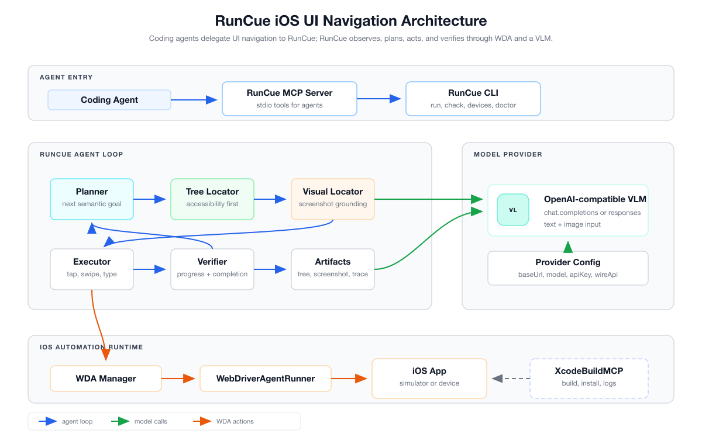

<p align="center">
  
</p>

<h1 align="center">RunCue</h1>

RunCue is a developer UI navigation tool for iOS apps. It uses natural-language tasks to navigate, type, inspect, and verify app UI through WebDriverAgent, with MCP tools designed to work alongside build tools such as XcodeBuildMCP.

RunCue is intentionally scoped: it does not build, install, or debug your app. Use XcodeBuildMCP or your normal Xcode workflow for build, launch, screenshots, and logs. Use RunCue when you need an agent to reach a specific UI state.

## Features

- WDA-only iOS automation for simulators and physical devices.
- MCP tools for coding agents: `runcue_run`, `runcue_check`, `runcue_devices`, and `runcue_doctor`.
- View-tree-first observation with screenshot fallback for WebView, SwiftUI, custom UI, and sparse accessibility trees.
- Direct WDA text input through `/keys`, avoiding paste-menu workarounds.
- Planner, locator, executor, and verifier loop for more stable multi-step navigation.

## Requirements

- macOS with Xcode installed.
- Node.js 20 or newer.
- A visible iOS Simulator or trusted physical iOS device.
- An OpenAI-compatible vision-language model (VLM) API key.

For physical devices, you also need:

- Device trust enabled.
- Developer Mode enabled.
- The device unlocked while running tasks.
- WebDriverAgent signing configured through `RUNCUE_WDA_TEAM_ID` or RunCue config.

## Install

```bash
npm install -g runcue
```

For local development from this repository:

```bash
npm install
npm run build
node dist/cli.js --help
```

## Configure Models

RunCue needs a vision-language model, not a text-only LLM. The provider must be OpenAI-compatible and support image input for visual fallback, visual grounding, and screenshot checks.

Supported wire APIs:

- `chat` using `chat.completions` with text and `image_url` content parts. This is the default.
- `responses` using the OpenAI Responses API with `input_text` and `input_image`.

The local config file is:

```text
~/.runcue/config.json
```

RunCue uses built-in defaults when this file does not exist. The file is created when you run `runcue config set ...`, or you can create it manually.

Inspect the effective config:

```bash
runcue config list
```

Set the default provider:

```bash
runcue config set provider my-vl
```

Environment variable references such as `${MY_VL_API_KEY}` are resolved at runtime. A minimal custom provider looks like this:

```json
{
  "vlm": {
    "default": "my-vl",
    "providers": {
      "my-vl": {
        "baseUrl": "https://api.example.com/v1",
        "model": "your-vl-model",
        "apiKey": "${MY_VL_API_KEY}",
        "wireApi": "chat",
        "inputMode": "viewtree"
      }
    }
  }
}
```

Provider fields:

| Field | Required | Meaning |
| --- | --- | --- |
| `baseUrl` | Yes | OpenAI-compatible API base URL. |
| `model` | Yes | VLM model name accepted by that provider. |
| `apiKey` | Yes | API key value or environment reference such as `${MY_VL_API_KEY}`. |
| `wireApi` | No | `chat` or `responses`; defaults to `chat`. |
| `inputMode` | No | `viewtree` or `screenshot`; defaults to `viewtree`. Use `screenshot` only for providers/apps where visual-only operation is preferred. |
| `headers` | No | Extra HTTP headers to pass to the provider. |

RunCue ships with several built-in provider examples, including DashScope/Qwen VL. They are examples, not a requirement. For example:

```bash
export DASHSCOPE_API_KEY="your-dashscope-api-key"
runcue config set provider dashscope-vl-plus
```

## Quick Start

List devices:

```bash
runcue devices
```

Check WDA readiness:

```bash
runcue doctor --device "iPhone 17 Pro Simulator" --platform ios-simulator
```

Run a navigation task:

```bash
runcue run "Open Maps, search for the nearest Walmart, and start navigation" \
  --device "iPhone 17 Pro Simulator" \
  --platform ios-simulator \
  --bundle-id com.apple.Maps \
  --fresh-app \
  --max-steps 10 \
  --timeout 120
```

For complex or non-standard app flows, include product-specific UI knowledge in the task or `hints`, for example:

```bash
runcue run "Open Maps, search for the nearest Walmart, and start navigation. In Apple Maps, if there is no normal Start Navigation button, tap the Route Steps item in the route card list to enter navigation." \
  --device "iPhone 17 Pro Simulator" \
  --platform ios-simulator \
  --bundle-id com.apple.Maps \
  --fresh-app
```

## MCP Usage

RunCue exposes an MCP server over stdio:

```bash
runcue mcp
```

Example Codex MCP configuration:

```toml
[mcp_servers.RunCue]
type = "stdio"
command = "runcue"
args = ["mcp"]
```

For a local checkout:

```toml
[mcp_servers.RunCue]
type = "stdio"
command = "node"
args = ["/absolute/path/to/RunCue/dist/cli.js", "mcp"]
```

## MCP Tools

- `runcue_run`: autonomously navigate a UI flow.
- `runcue_check`: inspect the current UI state with a question.
- `runcue_devices`: list iOS devices and simulators visible to Xcode.
- `runcue_doctor`: diagnose WDA setup and signing issues.

## Architecture



The current architecture is WDA-only:

```text
Coding Agent
  -> RunCue MCP / CLI
  -> Agent loop: planner -> locator -> executor -> verifier
  -> WebDriverAgent HTTP API
  -> iOS Simulator or physical iOS device
```

See [docs/architecture.md](docs/architecture.md) for the current architecture and [docs/tech-solution-v2.md](docs/tech-solution-v2.md) for the longer design record.

## Documentation

- [Usage Guide](docs/usage.md)
- [Architecture](docs/architecture.md)
- [WDA Setup](docs/wda-setup.md)
- [Troubleshooting](docs/troubleshooting.md)
- [Agent Integration](docs/agent-integration.md)
- [Development](docs/development.md)

## Development

```bash
npm install
npm run build
npm test
npm_config_cache=/private/tmp/runcue-npm-cache npm pack --dry-run
```

## Third-Party Code

RunCue vendors `appium-webdriveragent` so the CLI can bootstrap WDA without asking users to manually clone a separate project. See [THIRD_PARTY_NOTICES.md](THIRD_PARTY_NOTICES.md).

## License

RunCue is licensed under the MIT License. See [LICENSE](LICENSE).
