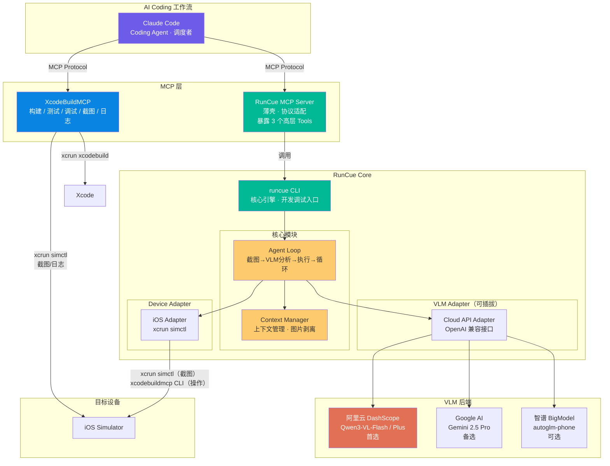
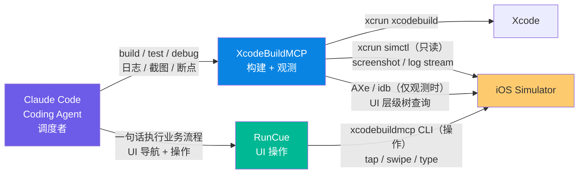
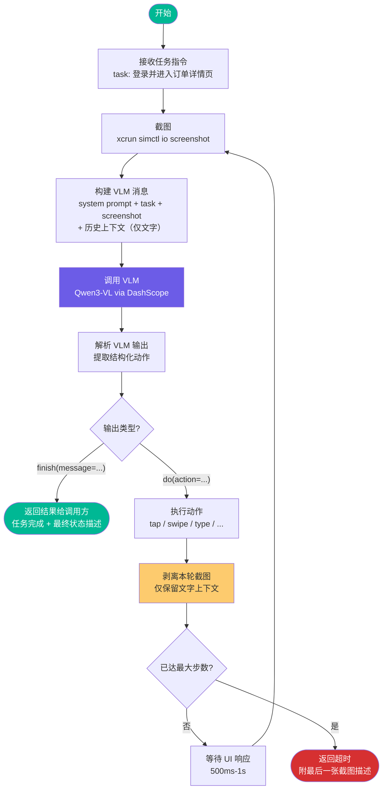
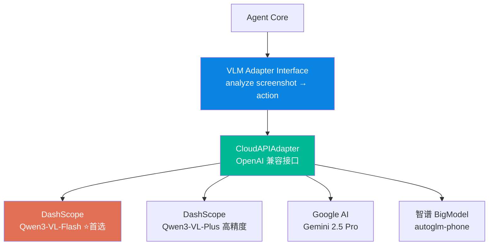
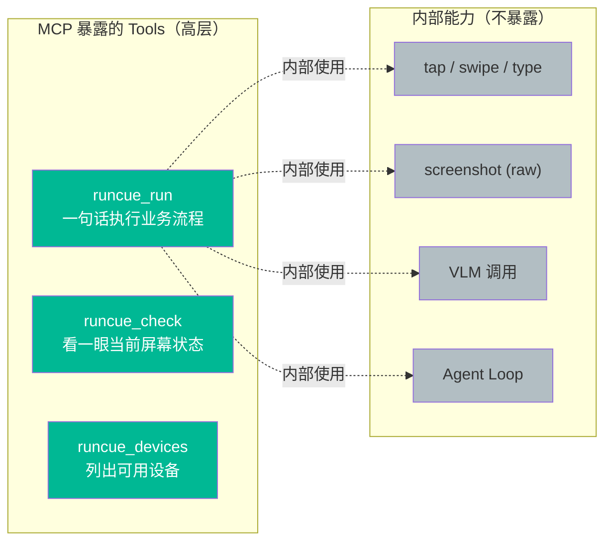

# RunCue 技术方案

> **状态**：历史 v1 方案，仅用于追溯旧设计。当前实现和后续讨论以
> `docs/tech-solution-v2.md` 为准；v2 已切换为 WDA-only，不再保留
> `simctl` / `legacy-simctl` 设备路径。

> **项目名称**：RunCue
> **版本**：v0.3
> **日期**：2026-04-12
> **作者**：Jason

---

## 一、项目背景

### 1.1 现状与痛点

当前团队已基于 **XcodeBuildMCP + Claude Code** 搭建了一套半自动化的 iOS 开发工作流，覆盖了从编码、构建、UI 自动化到调试的完整链路。XcodeBuildMCP 提供了 71 个工具（涵盖 build、test、debug、UI automation 等 13 个工作流组），Claude Code 作为 AI 编码智能体驱动整个流程。

然而在实际使用中，**UI 业务流程导航**存在显著的效率瓶颈：

| 问题 | 描述 |
|---|---|
| **手动复现耗时** | 开发者修改了某个深层页面的代码后，需要在模拟器上手动点击多步才能到达目标页面验证效果。改一行代码可能要花 30 秒手动导航 |
| **Token 消耗雪崩** | 如果让 Coding Agent（Claude Code）通过 XcodeBuildMCP 逐步操作 UI，每一步都需要截图→分析→决策→执行。由于多轮对话机制，**所有历史截图累积在上下文中**。一个 6 步的操作，Token 消耗呈等差数列增长，总计约 **121K Tokens**（约 ¥2.6/次） |
| **职责错配** | Claude（200B+ 参数旗舰模型）被用来做"看截图→点坐标"这种简单的视觉定位任务，大材小用 |

**核心洞察**：开发者需要一个**一句话跑完业务流程**的工具。改完代码后，只需说"登录并走到订单详情页"，工具自动完成多步 UI 导航，配合 XcodeBuildMCP 抓日志和截图，开发者直接看结果。

### 1.2 目标

构建 **RunCue** —— 开发者的 UI 导航工具，一句话跑完业务流程：

- **省去手动复现**：开发者不再需要手动在模拟器上点击多步到达目标页面
- **节省 Token**：将 Claude 的 UI 操作 Token 消耗降低 **97%+**（从 ~121K 降至 ~2.5K）
- **与 XcodeBuildMCP 协作**：RunCue 负责 UI 导航，XcodeBuildMCP 负责构建、截图、日志、调试，Coding Agent 编排两者
- **模型可插拔**：支持多种 VLM 后端（云端 API 为主），可按需切换

### 1.3 非目标

- 不替代 XcodeBuildMCP 的构建、测试、调试、截图能力
- 不做通用的 RPA / 自动化测试框架
- 不做类似 Claude Computer Use 的通用桌面操控
- 不处理 Webview 场景 —— Webview 内的操作通过 Playwright 等 Web 自动化工具解决，不属于 RunCue 的职责
- 不处理非 UI 类的开发任务

---

## 二、技术调研

### 2.1 业界方案调研

#### 2.1.1 midscene.js（ByteDance web-infra）

[midscene.js](https://github.com/web-infra-dev/midscene)（12.6k stars，MIT 协议）是 AI 驱动的视觉自动化框架，与 RunCue 的目标有较大重叠：

| 能力 | midscene.js | 备注 |
|---|---|---|
| MCP Server | ✅ `@midscene/web-bridge-mcp`、iOS/Android MCP | 已有 |
| CLI | ✅ `@midscene/cli`、`npx @midscene/ios` | 已有 |
| iOS 支持 | ✅ 基于 WDA | 非 simctl |
| Android 支持 | ✅ 基于 ADB | 已有 |
| Agent Loop | ✅ 截图→VLM→操作→循环 | 架构类似 |
| VLM 可插拔 | ✅ OpenAI 兼容接口 | 推荐 Qwen/Gemini |

**不采用 midscene.js 的原因**：
- 它是通用自动化框架（Web/Desktop/Mobile/HarmonyOS），对我们的场景过重
- iOS 支持基于 WDA（需编译部署+证书），我们优先用 simctl（零依赖）
- 我们需要与 XcodeBuildMCP 深度协作的定制能力，而非通用 RPA

**借鉴价值**：架构设计（Agent Loop + 上下文管理 + VLM 可插拔）验证了我们的技术方向是正确的。更重要的是，Midscene.js 的 **XML 结构化输出格式** 和 **冲突解决策略** 被 RunCue 直接采纳，用于解决 VLM thinking/action 矛盾问题（详见 4.7 节）。

#### 2.1.2 AutoGLM（智谱 AI）

AutoGLM 是智谱 AI 开源的手机操控框架，采用 Planner-Grounder 双层架构。

**借鉴价值**：
- 上下文管理策略（`remove_images_from_message()`）—— 每步剥离历史截图，仅保留文字上下文，是解决 Token 累积的关键
- `do(action=..., element=[x,y])` 输出格式天然适合解析和执行

**不采用的原因**：
- AutoGLM-Phone-9B 主要在 Android 截图上训练，iOS 精度未验证
- 本地部署需要 ~48GB VRAM GPU，Mac 上跑不动
- 智谱免费 API 是限时的，没有持久免费额度
- 双层模型（Planner + Grounder）在我们的场景下不需要 —— 用户直接给出明确指令，不需要额外的任务规划层

#### 2.1.3 设备控制方案

**iOS 设备控制**：

| 方案 | 原理 | 模拟器 | 真机 | 优势 | 劣势 |
|---|---|---|---|---|---|
| **xcrun simctl** | Apple 官方 CLI | ✅ | ❌ | 零依赖、稳定、截图 | ⚠️ 不支持 tap/swipe（部分 Xcode 版本） |
| **XcodeBuildMCP CLI** | 基于 idb 的 UI 自动化 | ✅ | ❌ | 完整的 tap/swipe/type/button 支持 | 需安装 xcodebuildmcp |
| **WebDriverAgent (WDA)** | XCUITest Bundle + HTTP Server | ✅ | ✅ | 真机+模拟器通用 | 需编译部署、依赖开发者证书 |

**决策**：MVP 阶段使用 **xcrun simctl**（截图）+ **xcodebuildmcp CLI**（UI 操作）。`simctl io` 在部分 Xcode 版本不支持 tap/swipe 子命令，因此触控操作通过 `xcodebuildmcp ui-automation` CLI 执行（底层基于 Facebook idb）。真机场景远期预留 WDA 接口。

#### 2.1.4 视觉模型选型

| 模型 | GUI Grounding | 速度 | 部署方式 | 成本 | 适合度 |
|---|---|---|---|---|---|
| **Qwen3-VL-Flash** | ✅ GUI Agent 专项优化 | 快 | 阿里云 DashScope | 低 | ⭐⭐⭐ 首选（高频多步场景） |
| **Qwen3-VL-Plus** | ✅ GUI Agent 专项优化 | 中（支持 thinking 模式） | 阿里云 DashScope | 中 | ⭐⭐⭐ 备选（复杂页面/高精度） |
| **Gemini 2.5/3 Pro** | ✅ Computer Use | 中 | Google API | 按量计费 | ⭐⭐ 备选 |
| **Qwen2.5-VL-72B** | ✅ 原生支持 | 中 | DashScope | 按量计费 | ⭐ 上一代，可用 |
| **AutoGLM-Phone-9B** | ✅ 手机专项 | 快 | 智谱(限时免费) / 本地(48GB VRAM) | 不确定 | ⚠️ iOS 精度未知 |

Qwen3-VL 是 Qwen2.5-VL 的下一代，**明确为 Visual Agent / GUI 场景优化**，支持 GUI 导航、元素识别、坐标输出。

**决策**：
- **默认使用 `qwen3-vl-flash`**：RunCue 场景是高频多步操作（每步调一次 VLM），速度和成本是关键，Flash 版本最合适
- **复杂场景切换 `qwen3-vl-plus`**：遇到复杂页面识别不准时，可切换到 Plus 版本（支持 thinking 深度推理）
- 模型层设计为**可插拔架构**，通过 OpenAI 兼容接口统一适配，切换仅需修改 `baseUrl` + `model` + `apiKey`
- 不做双层模型 —— 一个 VLM 同时完成"看截图 + 出坐标"

#### 2.1.5 云端 API 服务商

| 服务商 | 模型 | Base URL | 定价 | 推荐度 |
|---|---|---|---|---|
| **阿里云 DashScope** | `qwen3-vl-flash` | `https://dashscope.aliyuncs.com/compatible-mode/v1` | 低成本 | ⭐ 首选（默认） |
| **阿里云 DashScope** | `qwen3-vl-plus` | 同上 | 按量计费 | ⭐ 高精度备选 |
| **Google AI** | `gemini-2.5-pro` | `https://generativelanguage.googleapis.com/v1beta` | 按量计费 | 备选 |
| **智谱 BigModel** | `autoglm-phone` | `https://open.bigmodel.cn/api/paas/v4` | 限时免费 | 可选 |

所有平台均兼容 OpenAI Chat Completions API，切换仅需修改配置。

### 2.2 Token 消耗量化分析

以一个典型的 6 步 UI 操作任务为例（如"登录→进入订单列表→点击第一个订单"）：

**Coding Agent 直接操作 XcodeBuildMCP（现状）**：

```
Round 1: [system + task]                           → ~5K tokens
Round 2: [system + task + screenshot₁ + response₁]  → ~25K tokens
Round 3: [system + task + screenshot₁₋₂ + response₁₋₂] → ~45K tokens
...
Round 6: [system + task + screenshot₁₋₆ + response₁₋₆] → ~121K tokens（累计）
```

由于 **Claude 的多轮对话机制会携带全部历史消息（含截图）**，Token 消耗呈等差数列增长。

**RunCue 方案**：

```
Coding Agent → RunCue: "登录测试账号，进入订单详情页"  → ~2K tokens（Claude 侧）
RunCue 内部（VLM 无状态调用，上下文不累积）:
  Step 1: screenshot + prompt → VLM → action  → ~1.5K tokens
  Step 2: screenshot + prompt → VLM → action  → ~1.5K tokens
  ...
  Step 6: screenshot + prompt → VLM → action  → ~1.5K tokens
RunCue → Coding Agent: "已到达订单详情页" → ~0.5K tokens

VLM 总消耗: 6 × 1.5K = 9K tokens（DashScope 按量计费，成本极低）
Claude 总消耗: ~2.5K tokens
```

| 指标 | Claude 直操 | RunCue | 节省 |
|---|---|---|---|
| Claude Token 消耗 | ~121K | ~2.5K | **97.9%** |
| VLM Token 消耗 | 0 | ~9K（DashScope 低价） | - |
| 总耗时 | ~24s（6×4s） | ~12s（6×2s + 通信开销） | **50%** |

---

## 三、整体架构

### 3.1 系统架构图



### 3.2 分层设计

```
┌─────────────────────────────────────────────────┐
│  MCP Layer （协议适配层）                         │
│  - JSON-RPC 协议处理                              │
│  - 暴露 3 个高层 Tools                            │
│  - 不暴露原子操作（tap/swipe）                     │
├─────────────────────────────────────────────────┤
│  CLI Layer （命令行接口层）                        │
│  - runcue run/screenshot/analyze/tap/...         │
│  - 参数解析、输出格式化                            │
│  - 开发调试入口                                    │
├─────────────────────────────────────────────────┤
│  Agent Core （核心引擎层）                        │
│  - Agent Loop：多步自治循环                       │
│  - Context Manager：上下文管理 + 图片剥离          │
│  - Action Parser：VLM 输出解析                    │
│  - Step History：步骤记录与回溯                    │
├─────────────────────────────────────────────────┤
│  Adapter Layer （适配层）                         │
│  ┌─────────────────┐  ┌──────────────────────┐  │
│  │  VLM Adapter     │  │  Device Adapter      │  │
│  │  - CloudAPI      │  │  - iOSSimctl (MVP)   │  │
│  │   (OpenAI 兼容)  │  │  - AndroidADB (远期) │  │
│  └─────────────────┘  └──────────────────────┘  │
├─────────────────────────────────────────────────┤
│  Infrastructure （基础设施层）                     │
│  - Config：配置管理（模型 / 设备 / 参数）           │
│  - Logger：结构化日志                              │
│  - Screenshot Cache：截图缓存与清理                │
└─────────────────────────────────────────────────┘
```

### 3.3 与 XcodeBuildMCP 的协作关系

#### 3.3.1 职责划分



两个 MCP Server 独立运行，无直接通信。**Coding Agent（Claude Code）是唯一的调度者**，负责编排两个 MCP 的调用时序。

| 职责 | XcodeBuildMCP | RunCue |
|---|---|---|
| 构建 & 部署 | ✅ build / install / launch | ❌ |
| UI 操作（tap / swipe / type） | ⚠️ 有能力但让位给 RunCue | ✅ 独占 |
| 截图 | ✅ | ❌ 仅内部 Agent Loop 使用 |
| 日志抓取 | ✅ log stream | ❌ |
| 断点 & 变量读取 | ✅ LLDB | ❌ |
| UI 层级树查询 | ✅ AXe / snapshot-ui | ❌ |

#### 3.3.2 核心设计原则

> **UI 操作权归 RunCue 独占。** 当 RunCue 在执行业务流程时，XcodeBuildMCP 只做非 UI 操作（日志、断点、变量读取、UI 层级树查询）。Coding Agent 负责编排时序，不需要两个 MCP 之间做任何通信或锁机制。

**为什么可以共存？**

两个 MCP 都通过 `xcrun simctl` 和 `xcodebuildmcp` CLI 与模拟器交互，底层都是向系统服务 `CoreSimulatorService`（XPC daemon）发命令：

```
XcodeBuildMCP  ──→  xcrun simctl / AXe(idb)  ──→  CoreSimulatorService (XPC) ──→ 模拟器
RunCue         ──→  xcrun simctl（截图）       ──→  CoreSimulatorService (XPC) ──→ 模拟器
               ──→  xcodebuildmcp CLI（操作）  ──→  idb ──→ 模拟器
```

`CoreSimulatorService` 负责仲裁并发访问。XcodeBuildMCP 的 "session" 机制仅用于记住当前操作的项目/模拟器配置，**不是排它锁**，不会阻止其他进程访问同一模拟器。

#### 3.3.3 并行规则

| XcodeBuildMCP 操作 | RunCue 操作 | 能否并行 | 原因 |
|---|---|---|---|
| 抓日志（log stream） | UI 导航（tap/swipe/type） | ✅ **可以** | 日志是后台持续流，UI 操作走 HID 触摸通道，互不干扰 |
| 设断点 / 读取变量（LLDB） | UI 导航 | ✅ **可以** | debugger 走 LLDB 通道，与 UI 触摸事件完全独立 |
| UI 层级树查询（AXe / idb describe） | UI 导航 | ✅ **可以** | 层级树查询是只读操作 |
| 截图（simctl screenshot） | UI 导航 | ⚠️ **有风险** | 可能截到转场动画中间态，建议 RunCue 完成后再截图 |
| build + install + launch | UI 导航 | ❌ **不能** | app 未部署完成，无法操作 UI |
| UI 操作（AXe tap/swipe） | UI 操作（simctl tap/swipe） | ❌ **不能** | 两边同时注入触摸事件，UI 状态不可预测 |

**简化记忆**：XcodeBuildMCP 做"只读观测"时可以与 RunCue 并行；涉及"写入"操作（build/install/tap）时必须串行。

#### 3.3.4 Coding Agent 编排 Use Cases

**Use Case 1：改完代码验证 UI 效果**

场景：开发者修改了 `OrderDetailViewController` 的布局代码，需要验证渲染效果。

```
Agent 编排流程：

Phase 1 — 构建部署（串行，必须先完成）
  → XcodeBuildMCP: build_and_run(scheme: "MyApp")
  ← 返回: 构建成功，app 已启动

Phase 2 — 导航 + 观测（并行）
  → XcodeBuildMCP: start_log_capture(filter: "OrderDetail")     // 只读：抓日志
  → RunCue: runcue_run("登录测试账号，进入订单列表，点击第一个订单")  // 操作：UI 导航
  ← RunCue 返回: 已到达订单详情页
  ← XcodeBuildMCP: 日志持续抓取中

Phase 3 — 结果收集（串行，RunCue 已完成操作）
  → XcodeBuildMCP: screenshot()                 // 截图
  → XcodeBuildMCP: stop_log_capture()           // 收日志
  ← 返回给开发者: 截图 + 日志 + 分析结果
```

**Use Case 2：Debug 崩溃问题**

场景：开发者报告"进入支付页面后 crash"，Agent 需要复现并定位。

```
Agent 编排流程：

Phase 1 — 构建部署
  → XcodeBuildMCP: build_and_run(scheme: "MyApp", configuration: "Debug")

Phase 2 — 设断点 + 导航（并行）
  → XcodeBuildMCP: set_breakpoint(file: "PaymentViewController.swift", line: 42)
  → XcodeBuildMCP: start_log_capture(filter: "Payment")
  → RunCue: runcue_run("登录，添加一件商品到购物车，进入结算页面，点击支付")
  ← RunCue: 已点击支付按钮
  ← XcodeBuildMCP: 断点命中 / 或捕获到 crash 日志

Phase 3 — 信息收集
  → XcodeBuildMCP: read_variables()             // 读断点处变量
  → XcodeBuildMCP: screenshot()                 // 截图当前状态
  → XcodeBuildMCP: stop_log_capture()           // 收日志
  ← 返回给开发者: crash 原因分析 + 修复建议
```

**Use Case 3：验证注册流程完整性**

场景：改了注册相关代码，需要跑通完整注册→登录→首页流程。

```
Agent 编排流程：

Phase 1 — 构建部署
  → XcodeBuildMCP: build_and_run(scheme: "MyApp")

Phase 2 — 执行业务流程 + 日志监控（并行）
  → XcodeBuildMCP: start_log_capture()
  → RunCue: runcue_run("注册新账号 test123@test.com 密码 Test1234，完成注册，确认跳转到首页")
  ← RunCue: 已完成注册并到达首页

Phase 3 — 验证结果
  → XcodeBuildMCP: screenshot()                 // 截图首页
  → XcodeBuildMCP: stop_log_capture()           // 收日志，检查有无异常
  → XcodeBuildMCP: snapshot_ui()                // 抓 UI 层级树，验证首页元素
  ← 返回给开发者: 注册流程通过，截图 + 日志确认无异常
```

**Use Case 4：多轮交互式调试**

场景：Agent 在 debug 过程中需要反复操作 UI 并观察状态变化。

```
Agent 编排流程：

Phase 1 — 构建部署
  → XcodeBuildMCP: build_and_run(scheme: "MyApp")
  → XcodeBuildMCP: start_log_capture()

Phase 2 — 循环：操作 → 观察 → 操作 → 观察
  Loop:
    → RunCue: runcue_run("进入设置页面")         // RunCue 操作 UI
    ← RunCue: 已到达设置页面
    → XcodeBuildMCP: screenshot()               // 截图观察（RunCue 已停止操作）
    → XcodeBuildMCP: snapshot_ui()              // 查 UI 树
    ← Agent 分析结果，决定下一步

    → RunCue: runcue_run("打开通知设置，关闭推送通知")
    ← RunCue: 已完成
    → XcodeBuildMCP: screenshot()
    ← Agent 确认修改生效

Phase 3 — 结束
  → XcodeBuildMCP: stop_log_capture()
  ← 返回给开发者: 调试结论
```

#### 3.3.5 给 Coding Agent 的规则摘要

以下规则供 Coding Agent 在调用两个 MCP 时遵循：

```
## RunCue + XcodeBuildMCP 协作规则

1. 构建部署必须先完成：在调用 RunCue 之前，确保 XcodeBuildMCP 的
   build_and_run 已成功返回，app 已启动。

2. UI 操作权归 RunCue：当需要在模拟器上执行 UI 操作（点击、滑动、
   输入文本、导航业务流程），一律通过 RunCue。不要通过 XcodeBuildMCP
   的 AXe/idb 做 UI 操作（避免操作权冲突）。

3. 可与 RunCue 并行的 XcodeBuildMCP 操作：
   - start_log_capture / stop_log_capture（日志抓取）
   - set_breakpoint / read_variables（断点调试）
   - snapshot_ui（UI 层级树查询）

4. 必须等 RunCue 完成后才能执行的操作：
   - screenshot（避免截到转场中间态）
   - 任何需要稳定 UI 状态的分析操作

5. 设备标识必须从构建上下文传递：多个模拟器会同时运行（不同分支
   各自有专属模拟器）。Agent 必须将 XcodeBuildMCP build_and_run
   使用的目标设备标识（UDID 或设备名）显式传递给 RunCue 的
   --device / deviceId 参数。禁止使用 "booted" 或省略设备参数，
   否则会操作到错误的模拟器上。

6. RunCue 任务描述要具体：包含足够的上下文让 RunCue 自治完成，
   例如"用账号 test@test.com 密码 123456 登录，进入订单详情页"
   而非"登录"。
```

---

## 四、关键技术方案

### 4.1 Agent Loop（自治循环）

Agent Loop 是 RunCue 的核心，实现"截图→VLM 分析→执行动作→截图验证"的闭环循环。

#### 4.1.1 流程图



#### 4.1.2 上下文管理策略

这是节省 Token 的**最关键技术点**，借鉴自 AutoGLM 的上下文管理策略：

```
┌─ Step 1 ──────────────────────────────────┐
│ Messages:                                  │
│   [system] task description                │
│   [user]   screenshot₁(base64) + prompt    │  ← 当前步骤包含截图
│   [assistant] thinking... do(tap, [200,300])│
└────────────────────────────────────────────┘
                    ↓ 执行完毕后，剥离截图
┌─ Step 2 ──────────────────────────────────┐
│ Messages:                                  │
│   [system] task description                │
│   [user]   "步骤1已执行: tap(200,300)"      │  ← 截图已剥离，仅保留文字
│   [assistant] thinking... do(tap, [200,300])│
│   [user]   screenshot₂(base64) + prompt    │  ← 仅当前步骤有截图
│   [assistant] thinking... do(swipe, ...)   │
└────────────────────────────────────────────┘
```

每轮只有**当前步骤**携带截图，历史步骤仅保留文字摘要。这确保了 VLM 的输入 Token 数**不会随步骤增长而累积**。

#### 4.1.3 VLM Prompt 设计

这是驱动 Qwen3-VL 做 GUI Agent 的核心。**使用 XML 结构化输出格式**，将 thinking 和 action 物理隔离到不同标签，避免模型"想对做错"的问题（详见 4.7 节难点分析）。

**System Prompt（固定）**：

```typescript
const SYSTEM_PROMPT = `你是一个 iOS 模拟器 UI 操作助手。你的任务是根据截图和用户指令，判断下一步应该执行什么操作。

## 坐标系统
屏幕坐标使用 0-1000 归一化范围（左上角为 [0,0]，右下角为 [1000,1000]）。

## 输出格式

你必须使用 XML 标签输出。每次回复必须包含 <thought> 标签，然后根据情况输出操作或完成。

### 步骤 1：分析（必须）
<thought>分析当前页面状态，描述你看到了什么，判断下一步应该做什么。NEVER skip this tag.</thought>

### 步骤 2：执行（二选一）

**路径 A — 需要执行操作时：**
<action>tap</action>
<param>{"coordinate": [x, y]}</param>

**路径 B — 任务已完成时：**
<complete success="true">完成结果的描述</complete>

## 重要规则
- 必须始终输出 <thought> 标签
- <action> 和 <complete> 二选一，不要同时输出
- coordinate 的值必须是 0-1000 之间的整数
- 如果目标元素不在当前可见区域，使用 swipe 滚动页面寻找
- <thought> 中决定了要执行的操作后，必须输出对应的 <action>，不要输出 wait
- wait 仅用于页面正在加载或转场动画中的情况`;
```

**User Message（每一步动态构建）**：

```typescript
// 第一步
messages = [
  { role: "system", content: SYSTEM_PROMPT },
  { role: "user", content: [
    { type: "image_url", image_url: { url: `data:image/png;base64,${screenshot}` } },
    { type: "text", text: "任务：用账号 test@test.com 密码 123456 登录，进入订单详情页" }
  ]}
];

// 第 N 步（历史步骤仅保留文字摘要，截图已剥离）
// 如果上一步执行失败，错误信息会附加到历史记录中
messages = [
  { role: "system", content: SYSTEM_PROMPT },
  { role: "user", content: "步骤1已执行: tap([500, 350])" },
  { role: "assistant", content: "<thought>输入框已激活</thought>" },
  { role: "user", content: "步骤2已执行: type('test@test.com')" },
  { role: "assistant", content: "<thought>邮箱已填写，点击密码框</thought>" },
  { role: "user", content: [
    { type: "image_url", image_url: { url: `data:image/png;base64,${screenshot}` } },
    { type: "text", text: "继续执行任务：用账号 test@test.com 密码 123456 登录，进入订单详情页" }
  ]}
];
```

**VLM 返回示例（完整多步流程）**：

```
Step 1 →
<thought>当前是登录页面，需要先点击邮箱输入框</thought>
<action>tap</action>
<param>{"coordinate": [500, 350]}</param>

Step 2 →
<thought>输入框已激活，输入邮箱地址</thought>
<action>type</action>
<param>{"text": "test@test.com"}</param>

Step 5 →
<thought>账号密码已填写，点击登录按钮</thought>
<action>tap</action>
<param>{"coordinate": [500, 600]}</param>

Step 7 →
<thought>已进入订单详情页，任务完成</thought>
<complete success="true">已到达订单详情页</complete>
```

#### 4.1.4 坐标转换

Qwen3-VL 输出 **0-1000 归一化坐标**，需要转换为模拟器实际像素坐标：

```typescript
function normalizedToPixel(
  coord: [number, number],
  screen: ScreenInfo
): { x: number; y: number } {
  return {
    x: Math.round((coord[0] / 1000) * screen.width),
    y: Math.round((coord[1] / 1000) * screen.height),
  };
}

// 示例：iPhone 16 模拟器 (390×844 逻辑点)
// VLM 输出 coordinate: [500, 350]
// → x = (500/1000) × 390 = 195
// → y = (350/1000) × 844 = 295
// → simctl io tap 195 295
```

> **注意**：`xcrun simctl io tap` 使用的是**逻辑点（point）**而非物理像素。iPhone 16 逻辑分辨率 390×844，物理分辨率 1170×2532（@3x）。VLM 截图和 simctl tap 都基于逻辑点坐标系，无需额外换算。

#### 4.1.5 支持的动作类型

| 动作 | VLM 输出格式 | 坐标转换 | iOS 执行命令 |
|---|---|---|---|
| 点击 | `{"action":"tap","coordinate":[x,y]}` | 归一化→像素 | `xcodebuildmcp ui-automation tap --simulator-id <id> -x <px> -y <py>` |
| 长按 | `{"action":"long_press","coordinate":[x,y]}` | 归一化→像素 | `xcodebuildmcp ui-automation long-press --simulator-id <id> -x <px> -y <py> --duration <s>` |
| 滑动 | `{"action":"swipe","from":[x1,y1],"to":[x2,y2]}` | 归一化→像素 | `xcodebuildmcp ui-automation swipe --simulator-id <id> --x1 --y1 --x2 --y2` |
| 输入文本 | `{"action":"type","text":"..."}` | 无需转换 | ASCII: `type-text` HID 键码；非 ASCII/特殊字符: `simctl pbcopy` + 原生粘贴菜单 |
| Home | `{"action":"home"}` | 无需转换 | `xcodebuildmcp ui-automation button --simulator-id <id> --button-type home` |
| 等待 | `{"action":"wait"}` | 无需转换 | sleep |
| 完成 | `{"action":"finish","message":"..."}` | 无需转换 | 返回结果，退出循环 |

### 4.2 VLM Adapter（模型适配层）

#### 4.2.1 可插拔架构



由于所有云端 API 均兼容 OpenAI Chat Completions 接口，**MVP 阶段只需实现一个 CloudAPIAdapter**，通过配置切换不同模型和服务商。

#### 4.2.2 Adapter 接口定义

```typescript
interface VLMAdapter {
  /** 模型标识 */
  readonly name: string;

  /** 分析截图，返回思考过程和动作指令 */
  analyze(input: {
    screenshot: Buffer;          // 截图 PNG 二进制
    task: string;                // 任务描述
    history: HistoryEntry[];     // 历史步骤（仅文字，截图已剥离）
    screenInfo: ScreenInfo;      // 屏幕分辨率（用于坐标转换）
  }): Promise<{
    thinking: string;            // 模型思考过程（VLM 返回的 thought 字段）
    action: Action;              // 解析后的结构化动作（已完成坐标转换）
    raw: string;                 // 原始模型 JSON 输出
  }>;
}

/** VLM 返回的归一化坐标 (0-1000)，Adapter 内部转换为像素坐标后输出 */
type Action =
  | { type: "tap"; x: number; y: number }
  | { type: "long_press"; x: number; y: number }
  | { type: "swipe"; x1: number; y1: number; x2: number; y2: number }
  | { type: "type"; text: string }
  | { type: "home" }
  | { type: "wait" }
  | { type: "finish"; message: string };
```

### 4.3 Device Adapter（设备适配层）

#### 4.3.1 接口定义

```typescript
interface DeviceAdapter {
  /** 平台标识 */
  readonly platform: "ios" | "android";

  /** 设备标识 */
  readonly deviceId: string;

  /** 截图，返回 PNG Buffer */
  screenshot(): Promise<Buffer>;

  /** 获取屏幕尺寸 */
  getScreenInfo(): Promise<ScreenInfo>;

  /** 点击 */
  tap(x: number, y: number): Promise<void>;

  /** 长按 */
  longPress(x: number, y: number, duration?: number): Promise<void>;

  /** 滑动 */
  swipe(x1: number, y1: number, x2: number, y2: number, duration?: number): Promise<void>;

  /** 输入文本 */
  typeText(text: string): Promise<void>;

  /** 回到主屏幕 */
  home(): Promise<void>;
}
```

#### 4.3.2 iOS Adapter 实现要点

截图通过 `xcrun simctl`，触控操作通过 `xcodebuildmcp ui-automation` CLI（底层基于 Facebook idb）：

```typescript
class iOSSimctlAdapter implements DeviceAdapter {
  readonly platform = "ios";

  async screenshot(): Promise<Buffer> {
    const tmpPath = `/tmp/runcue-${Date.now()}.png`;
    await exec(`xcrun simctl io ${this.deviceId} screenshot --type=png ${tmpPath}`);
    const buffer = await fs.readFile(tmpPath);
    await fs.unlink(tmpPath);
    return buffer;
  }

  async tap(x: number, y: number): Promise<void> {
    const simId = await this.getSimulatorId(); // resolve "booted" → UDID
    await exec(`xcodebuildmcp ui-automation tap --simulator-id ${simId} -x ${x} -y ${y}`);
  }

  async swipe(x1: number, y1: number, x2: number, y2: number): Promise<void> {
    const simId = await this.getSimulatorId();
    await exec(`xcodebuildmcp ui-automation swipe --simulator-id ${simId} --x1 ${x1} --y1 ${y1} --x2 ${x2} --y2 ${y2}`);
  }

  async typeText(text: string): Promise<void> {
    const simId = await this.getSimulatorId();
    // ASCII-safe text: HID key simulation (fast, reliable)
    // Non-ASCII (Chinese etc.) or shifted chars: clipboard paste
    if (/[!@#$%^&*()_+{}|:"<>?~]/.test(text) || /[^\x00-\x7F]/.test(text)) {
      await this.pasteViaClipboard(text, simId);
      return;
    }
    await exec(`xcodebuildmcp ui-automation type-text --simulator-id ${simId} --text "${text}"`);
  }

  async home(): Promise<void> {
    const simId = await this.getSimulatorId();
    await exec(`xcodebuildmcp ui-automation button --simulator-id ${simId} --button-type home`);
  }
}
```

### 4.4 MCP Server 层

#### 4.4.1 设计原则：薄壳 + 高层 Tools

MCP 层**不暴露原子操作**（tap / swipe / screenshot），只暴露高层语义 Tools。这是防止 Coding Agent 退化为逐步操作模式的关键设计。



#### 4.4.2 Tools 定义

**Tool 1: `runcue_run`（核心）**

```json
{
  "name": "runcue_run",
  "description": "一句话在 iOS 模拟器上执行多步 UI 操作。RunCue 会自动完成截图→分析→操作的循环，直到任务完成或达到最大步数。适用于：导航到指定页面、完成登录/注册流程、填写表单、执行任意多步 UI 交互。",
  "inputSchema": {
    "type": "object",
    "properties": {
      "task": {
        "type": "string",
        "description": "要执行的 UI 任务描述，例如'用账号 test@test.com 密码 123456 登录，进入订单详情页'"
      },
      "deviceId": {
        "type": "string",
        "description": "模拟器 UDID，默认使用当前活跃设备"
      },
      "maxSteps": {
        "type": "number",
        "description": "最大操作步数，默认 10"
      }
    },
    "required": ["task"]
  }
}
```

**Tool 2: `runcue_check`（查看屏幕状态）**

```json
{
  "name": "runcue_check",
  "description": "截图并分析当前 UI 状态，返回文字描述。不执行任何操作。用于验证 RunCue 操作结果或检查页面状态。",
  "inputSchema": {
    "type": "object",
    "properties": {
      "question": {
        "type": "string",
        "description": "要检查的问题，如'当前页面是什么''是否已登录成功'"
      },
      "deviceId": { "type": "string" }
    },
    "required": ["question"]
  }
}
```

**Tool 3: `runcue_devices`（设备列表）**

```json
{
  "name": "runcue_devices",
  "description": "列出所有可用的 iOS 模拟器及其状态。",
  "inputSchema": {
    "type": "object",
    "properties": {}
  }
}
```

### 4.5 CLI 设计

CLI 是 RunCue 的主要开发调试入口：

```
runcue <command> [options]

Commands:
  run <task>            一句话执行 UI 任务（核心命令）
  screenshot            截取当前屏幕
  check <question>      截图 + VLM 分析当前状态
  tap <x> <y>           点击指定坐标（调试用）
  swipe <x1> <y1> <x2> <y2>  滑动（调试用）
  type <text>           输入文本（调试用）
  devices               列出可用设备
  config                配置管理

Options:
  --device, -d      模拟器 UDID                    [default: "booted"]
  --model, -m       VLM 模型                       [default: "qwen3-vl-flash"]
  --provider        模型服务商                      [default: "dashscope"]
  --max-steps       最大步数                        [default: 10]
  --verbose, -v     详细输出                        [default: false]
  --dry-run         仅分析不执行                    [default: false]
  --output, -o      输出格式 text|json              [default: "text"]
```

**使用示例**：

```bash
# 核心用法：一句话执行业务流程
runcue run "登录测试账号 test@test.com，进入订单详情页"
runcue run "注册新用户并完成引导流程" --max-steps 15
runcue run "打开设置，进入通用，检查软件版本号"

# 查看当前屏幕状态
runcue check "当前在哪个页面"
runcue check "登录按钮是否可见"

# 调试命令（开发时使用）
runcue screenshot
runcue tap 200 300
runcue devices

# 使用其他模型
runcue run "点击搜索按钮" --provider google --model gemini-2.5-pro

# 配置管理
runcue config set provider dashscope
runcue config set apiKey <api-key>
runcue config list
```

### 4.6 配置管理

配置文件位于 `~/.runcue/config.json`：

```json
{
  "defaultDevice": "booted",
  "maxSteps": 10,
  "stepDelay": 500,

  "vlm": {
    "default": "dashscope",
    "providers": {
      "dashscope": {
        "baseUrl": "https://dashscope.aliyuncs.com/compatible-mode/v1",
        "model": "qwen3-vl-flash",
        "apiKey": "${DASHSCOPE_API_KEY}"
      },
      "dashscope-plus": {
        "baseUrl": "https://dashscope.aliyuncs.com/compatible-mode/v1",
        "model": "qwen3-vl-plus",
        "apiKey": "${DASHSCOPE_API_KEY}"
      },
      "google": {
        "baseUrl": "https://generativelanguage.googleapis.com/v1beta/openai",
        "model": "gemini-2.5-pro",
        "apiKey": "${GOOGLE_API_KEY}"
      },
      "zhipu": {
        "baseUrl": "https://open.bigmodel.cn/api/paas/v4",
        "model": "autoglm-phone",
        "apiKey": "${ZHIPU_API_KEY}"
      }
    }
  }
}
```

### 4.7 难点：VLM 输出可靠性 — Thinking/Action 矛盾问题

#### 4.7.1 问题描述

在实际测试中发现 Qwen3-VL 频繁出现 **thinking 与 action 矛盾** 的现象：模型的 thought 正确分析了该做什么（如"需要点击隐私保管箱"），但 action 字段却输出了 `wait`。

**典型失败日志**：

```
[agent-loop] Thinking: 当前在设置页面，已找到'隐私保管箱'选项，
             显示'已关闭'，需要点击进入才能设置密码。
[agent-loop] Action: wait()
```

这不是偶发现象——在 10 步以内的任务中，几乎每次都会出现至少 1-2 次矛盾。这意味着本应 3 步完成的任务被拉长到 7-8 步（中间穿插无意义的 wait），甚至因触达 maxSteps 限制而失败。

#### 4.7.2 根因分析

| 因素 | 分析 |
|------|------|
| **JSON 格式的结构缺陷** | `{"thought": "需要点击X", "action": "wait"}` —— thought 和 action 在同一个 JSON 对象中，模型可以在一个字段里"想对"，在另一个字段里"做错"，没有结构性约束防止矛盾 |
| **VLM 的保守倾向** | 小型 VLM（7B-14B 级别）在不确定时倾向于输出"最安全"的 action。`wait` 是零风险选项（不改变状态），模型在 thought 中分析正确但不敢执行 |
| **无互斥路径约束** | JSON 格式中 action 可以是 tap/swipe/type/wait/finish 中的任意一个，没有"要么操作要么完成"的二选一约束 |

#### 4.7.3 解决方案：XML 结构化输出（参考 Midscene.js）

参考 [Midscene.js](https://github.com/web-infra-dev/midscene)（ByteDance web-infra，12.6k stars）的设计模式，从**输出格式、解析器、运行时保护**三个层面系统性解决。

##### (1) 输出格式：从自由 JSON 到 XML 标签隔离

**Before（JSON）**—— thinking 和 action 混在一个对象里：
```json
{"thought": "需要点击X", "action": "wait", "coordinate": [500, 300]}
```

**After（XML）**—— thinking 和 action 物理隔离，互斥路径约束：
```xml
<thought>需要点击隐私保管箱进入设置密码</thought>
<action>tap</action>
<param>{"coordinate": [500, 300]}</param>
```

核心设计原则：

| 原则 | 说明 |
|------|------|
| **物理隔离** | `<thought>` 和 `<action>` / `<complete>` 是独立标签，不在同一个数据结构内 |
| **互斥路径** | 模型只有两条输出路径：路径 A 输出 `<action>` + `<param>`，路径 B 输出 `<complete>`。没有第三种状态 |
| **必填约束** | `<thought>` 标签在 prompt 中被标记为 `NEVER skip this tag`，多处强调 |
| **冲突解决** | 如果模型同时输出了 `<action>` 和 `<complete>`，解析器以 **action 优先**（参考 Midscene 的做法：宁可多执行一步，也不要错误终止） |
| **完整示例** | prompt 中为每种 action 提供完整的 XML 输出示例，降低模型输出格式错误的概率 |

##### (2) 解析器：反向搜索 + 多层 fallback

```
原始输出 → stripThinkTags → extractXMLTag(反向搜索) → safeParseJSON(param)
                                                      ↓ 失败
                                               legacy JSON fallback
                                                      ↓ 失败
                                              标记 parseFailure → 触发重试
```

**`extractXMLTag` 反向搜索**：从字符串末尾向前查找目标标签。这样即使模型在前面输出了 `<think>` 推理内容或其他干扰文本，也能正确提取到最后一个有效标签。

**Legacy JSON 兼容**：解析器保留了对旧版 JSON 格式的 fallback 支持，使得切换输出格式时无需一次性完成——如果 VLM 回退到 JSON 输出，仍然能被正确解析。

##### (3) 运行时保护

| 机制 | 说明 |
|------|------|
| **parseFailure 标记** | 解析器区分"模型显式输出 `<action>wait</action>`"和"解析失败 fallback 的 wait"，后者标记为 `parseFailure` |
| **解析失败自动重试** | `parseFailure=true` 时，VLM 调用层自动重试一次（temperature 略升至 0.1 引入微小随机性） |
| **连续 wait 保护** | 连续 3 次 wait 提前终止任务，避免无意义消耗步数 |
| **错误反馈上下文** | action 执行失败的错误信息注入下一轮 VLM 的历史上下文，帮助模型修正策略 |

#### 4.7.4 效果

| 指标 | Before（JSON） | After（XML） |
|------|----------------|--------------|
| thinking/action 矛盾率 | ~30-40%（几乎每个任务都会出现） | 实测中未再出现 |
| 平均任务步数 | 7-8 步（含无效 wait） | 3-5 步 |
| 任务成功率 | ~60%（经常因 maxSteps 耗尽失败） | 显著提升 |

#### 4.7.5 Midscene.js 设计模式借鉴总结

| Midscene.js 的做法 | RunCue 的采纳情况 |
|---------------------|-------------------|
| XML 结构化输出（`<thought>` + `<action-type>` + `<action-param-json>`） | ✅ 采纳：`<thought>` + `<action>` + `<param>` |
| 冲突解决：action 优先于 complete | ✅ 采纳 |
| `extractXMLTag` 反向搜索（跳过 `<think>` 前缀） | ✅ 采纳 |
| 半闭合标签 fallback | ✅ 采纳 |
| 解析失败重试（1 次） | ✅ 采纳 |
| 连续错误容忍计数（5 次） | ✅ 采纳（改为连续 wait 3 次） |
| 错误信息反馈给 VLM（`pendingFeedbackMessage`） | ✅ 采纳 |
| `jsonrepair` 库修复 JSON | ❌ 未采纳（当前 `safeParseJSON` + `extractJSON` 已够用） |
| Zod schema 渲染为 prompt 文本 | ❌ 未采纳（action 种类较少，直接写示例） |
| 多 VLM 后端适配（UI-TARS / AutoGLM 格式） | ❌ 暂不需要（仅用 OpenAI 兼容接口） |

### 4.8 架构演进：从截图到 View Tree + 自适应输入模式

#### 4.8.1 背景

v0.3 之前，RunCue 完全依赖截图 + VLM 视觉定位。实际测试中发现：

| 问题 | 表现 |
|------|------|
| **模型选择受限** | 只有 Qwen3-VL 等 visual grounding 专用模型能准确输出坐标。GPT-5.4、Claude 等通用 LLM 能"看懂"截图，但估算的坐标偏差达几十像素，反复点不中目标 |
| **坐标精度不可控** | 即使是 VL 专用模型，在小元素密集的界面（如设置列表）也会出现定位偏差 |

#### 4.8.2 解决方案：View Tree + Element ID

改用 iOS Simulator 的 accessibility tree（`xcodebuildmcp ui-automation snapshot-ui`）作为 LLM 的主要输入：

```
之前: 截图(图像) → VLM 视觉定位 → [614, 513](猜) → 转换 → tap(270, 490)
之后: view tree(文本) → LLM 选择元素 → id=5 → 查 frame → tap(270, 460) ✅精确
```

**View Tree 精简格式**：原始 `snapshot-ui` 输出每节点 ~15 个字段，精简为 6 个：

```json
{
  "id": 5,
  "label": "通用",
  "type": "Button",
  "frame": {"x": 20, "y": 381, "w": 400, "h": 52}
}
```

精简后一个设置页 ~1000 token，主屏 ~500 token。

**Action 类型变化**：模型不再输出坐标，而是输出元素 ID 和方向：

```typescript
// Before
| { type: "tap"; x: number; y: number }
| { type: "swipe"; x1: number; y1: number; x2: number; y2: number }

// After
| { type: "tap"; elementId: number }
| { type: "swipe"; direction: "up" | "down" | "left" | "right" }
```

坐标计算从 VLM 层移到 Agent Loop 层，通过 `findNodeById(viewTree, elementId)` 查到 frame，取中心点精确点击。

#### 4.8.3 输入模式策略：viewtree 优先 + screenshot fallback

RunCue 采用 **两种互斥输入模式**，每一步只使用一种信号源：

```
┌─────────────────────────────────────────┐
│         用户配置了 inputMode?            │
│                                         │
│   screenshot → 直接用 screenshot 模式    │
│   否 / viewtree ↓                       │
├─────────────────────────────────────────┤
│         获取 view tree                   │
│                                         │
│   失败 → fallback 到 screenshot 模式     │
│   成功 → viewtree 模式                  │
└─────────────────────────────────────────┘
```

两种输入模式：

| inputMode | LLM 收到的输入 | 坐标来源 | 适用场景 |
|-----------|---------------|---------|---------|
| `viewtree` | view tree 文本（不含截图） | frame 精确坐标 | 默认模式，accessibility 标注好的原生 app |
| `screenshot` | 截图（不含 view tree） | 模型估算坐标（`tap_xy`/`long_press_xy`） | VL 模型兜底，WebView 等无 accessibility 的场景 |

**为什么不做 hybrid（同时发送截图 + view tree）**：

实测发现，同时发送截图和 view tree 会导致模型混淆信号来源。典型问题：
- GPT-5.4 在收到 view tree 的同时看到截图中的浮层（view tree 中不存在），尝试用坐标点击但精度不够
- Qwen3-VL 收到双重输入后，将截图中看到的元素错误映射到 view tree 中坐标相近但语义不同的节点

根本原因：模型无法可靠判断"信任哪个信号源"。**一次只给一种信号，让模型在确定的上下文中决策，效果远好于同时给两种信号让模型自己选择**。

**用户覆盖**：通过 provider config 的 `inputMode` 字段指定：

```json
{
  "openai": {
    "baseUrl": "...",
    "model": "gpt-5.4",
    "inputMode": "viewtree"
  },
  "dashscope": {
    "baseUrl": "...",
    "model": "qwen3-vl-plus",
    "inputMode": "screenshot"
  }
}
```

#### 4.8.4 业界方案对比：为什么 RunCue 选择 View Tree

业界主流 UI 自动化框架（AutoGLM、Midscene.js）均采用**纯截图（vision-first）**方案，RunCue 选择 View Tree 是基于目标场景的差异化决策。

**AutoGLM（智谱 AI）—— 纯截图方案**：
- 用自研 VL 模型（AutoGLM-Phone-9B）直接从像素估算坐标，不依赖 accessibility tree
- 优势：通用性强，不要求 app 暴露 accessibility 标签，自绘 UI / 游戏也能操作
- 代价：必须使用 visual grounding 专用模型，通用 LLM（GPT-5.4、Claude）无法胜任

**Midscene.js（ByteDance web-infra）—— 纯截图方案**：
- 早期试过 DOM tree + 截图混合模式，后来发现 DOM 不稳定（canvas、跨域 iframe、无 label 组件等问题过多），**已移除 DOM 提取兼容模式**
- 当前完全依赖 VL 模型的视觉定位能力
- 唯一保留 DOM 的场景：数据提取（`aiQuery`/`aiAsk` 时可选 `domIncluded: true`），操作定位不用 DOM

**对比总结**：

| | AutoGLM | Midscene.js | RunCue |
|---|---|---|---|
| 操作定位 | 截图（像素） | 截图（像素） | View Tree（元素 ID） |
| 坐标来源 | VL 模型估算 | VL 模型估算 | 系统精确提供（frame 中心点） |
| 模型要求 | 专用 VL 模型 | 专用 VL 模型 | 任意 LLM（GPT-5.4 也行） |
| 截图作用 | 主输入 | 主输入 | 仅 screenshot fallback 模式（view tree 不可用时） |
| 目标场景 | 通用手机操控（任意 app） | 通用 UI 自动化（Web/Mobile/Desktop） | 开发者工具（iOS 模拟器调试） |
| 对 app 的要求 | 无 | 无 | 需要合理的 accessibility 标注 |

**RunCue 选择 View Tree 的理由**：
1. **目标场景不同**：RunCue 面向 iOS 模拟器上的开发调试，目标 app 是开发者自己的项目，accessibility tree 质量有保证。AutoGLM/Midscene 面向任意第三方 app，无法假设 accessibility 可用
2. **解锁模型选择**：View Tree 方案让任意 LLM（GPT-5.4、Claude、Gemini）都能驱动 UI 操作，不局限于 VL 专用模型
3. **精度确定性**：坐标由系统从 frame 精确计算，不存在模型估算偏差
4. **Token 效率**：一个设置页的 view tree ~1000 token，远低于截图的 ~20K token

#### 4.8.5 坐标 Fallback：应对 View Tree 盲区

View Tree 方案依赖 `axe describe-ui`（底层调用 FBSimulatorControl 的 `accessibilityElementsWithNestedFormat:`）获取 accessibility 层级。但实际使用中发现，**部分 UI 元素虽然在屏幕上可见，却不在 accessibility tree 中**。

**已确认的盲区场景**：

| 场景 | 原因 | 截图可见 | View Tree 可见 |
|------|------|---------|---------------|
| `window.addSubview()` 的浮层 + 有模态 VC present | 模态 VC 触发 `accessibilityViewIsModal`，屏蔽 window 上所有其他元素 | 是 | 否 |
| `window.addSubview()` 的浮层，无模态 VC | window 级 subview 可被 accessibility 遍历到 | 是 | **是** |
| 未设置 `isAccessibilityElement` 的控件 | 被系统过滤为"背景装饰" | 是 | 否 |
| `accessibilityElementsHidden = true` 的容器 | 显式禁用 accessibility | 是 | 否 |

**关键发现：`window.addSubview()` 不是根因，模态 present 才是**

实测验证：

- 在 **主页面** 播放视频浮窗（`window.addSubview(playerView)`），**view tree 能抓到** 播放器所有控件（ZFPlayer close、下载、播放进度条等）
- 在 **设置页面** 播放同一浮窗，Settings 是通过 `present(SettingsNavigationController)` 展示的，**view tree 抓不到** 播放器

原因是 iOS 的 `accessibilityViewIsModal` 机制：

```
UIWindow (BrowserWindow)
  ├── rootViewController: RootNavigationController
  │     └── BrowserViewController.view
  └── subviews (直接 addSubview)
        └── PlayerOverlayView          ← 浮层

无模态时：accessibility 遍历整个 window → PlayerOverlayView 可见 ✅

present(SettingsNavigationController) 后：
  UIWindow
    └── UITransitionView
        ├── RootNavigationController.view   ← 被 accessibilityViewIsModal 屏蔽
        │     └── PlayerOverlayView         ← 一起被屏蔽 ❌
        └── SettingsNavigationController.view ← 模态层，accessibility 唯一焦点
```

iOS 这样设计是为了 VoiceOver（盲人用户）：模态弹出后，用户不应该通过左右滑动遍历到被遮住的底层元素。`accessibilityViewIsModal = true` 让 accessibility 系统只暴露模态层内的元素。

**诊断方法**：

1. 确认当前是否有模态 VC：`rootViewController.presentedViewController != nil`
2. 对比有无模态时 `snapshot-ui` 的输出差异
3. 通过 `UIApplication.shared.connectedScenes` 遍历所有 window，对比 `window.subviews.count` 与 `rootViewController.view.subviews.count` 的差值

**应对策略——坐标点击 Fallback（tap_xy / long_press_xy）**：

当 view tree 无法覆盖目标元素时，可通过配置切换到 screenshot 模式（`inputMode: "screenshot"`），此时模型从截图中估算坐标：

```xml
<!-- viewtree 模式：元素在 view tree 中，用 id -->
<action>tap</action>
<param>{"id": 5}</param>

<!-- screenshot 模式：从截图中估算坐标 -->
<action>tap_xy</action>
<param>{"x": 30, "y": 120}</param>
```

**RunCue 自动 fallback**：当 tap/long_press 执行后 view tree 无变化时，RunCue 自动在下一步切换到 screenshot 模式，并注入 hint 告知模型原因。

**设计原则**：
- **两种模式互斥**：viewtree 模式只使用 `tap(id=N)`，screenshot 模式只使用 `tap_xy(x, y)`。不在同一步中混用两种信号
- **逻辑点坐标系**：screenshot 模式的 x/y 使用逻辑点坐标（非物理像素），与 view tree frame 坐标系一致
- **适用范围有限**：通用 LLM（GPT-5.4、Claude）的坐标估算精度不高，screenshot 模式主要适用于 VL 专用模型（Qwen3-VL 等）

#### 4.8.6 Q&A：App 侧的 Accessibility 适配

**Q: 我的 app 有浮层/自定义 window，RunCue 在 viewtree 模式下看不到怎么办？**

A: 首先确认问题场景——浮层在什么时候不可见：

- **无模态 VC 时就看不到**：检查浮层是否设置了 `isAccessibilityElement = true` 和 `accessibilityLabel`
- **有模态 VC present 时才看不到**：这是 iOS `accessibilityViewIsModal` 机制导致的，需要用独立 UIWindow 方案解决

有三种解决路径：

**路径 1（推荐）—— 浮层使用独立 UIWindow**：

播放器等需要始终浮在最上层的 UI，用独立 UIWindow 承载，完全脱离主 window 的模态语义：

```swift
class FloatingPlayerWindow: UIWindow {
    init(playerView: UIView, initialFrame: CGRect) {
        super.init(frame: initialFrame)
        windowLevel = .normal + 1  // 浮在主 window 之上

        let container = UIViewController()
        container.view.addSubview(playerView)
        playerView.frame = container.view.bounds
        playerView.autoresizingMask = [.flexibleWidth, .flexibleHeight]
        rootViewController = container
        isHidden = false

        // 拖动手势
        let pan = UIPanGestureRecognizer(target: self, action: #selector(handlePan))
        addGestureRecognizer(pan)
    }

    @objc private func handlePan(_ gesture: UIPanGestureRecognizer) {
        let translation = gesture.translation(in: self)
        frame.origin.x += translation.x
        frame.origin.y += translation.y
        gesture.setTranslation(.zero, in: self)
        if gesture.state == .ended { snapToEdge() }
    }

    private func snapToEdge() {
        guard let screen = windowScene?.screen else { return }
        let bounds = screen.bounds
        var origin = frame.origin
        let centerX = origin.x + frame.width / 2
        origin.x = centerX < bounds.width / 2 ? 8 : bounds.width - frame.width - 8
        origin.y = max(60, min(origin.y, bounds.height - frame.height - 80))
        UIView.animate(withDuration: 0.25) { self.frame.origin = origin }
    }
}
```

优点：
- 有自己的 rootViewController → accessibility 有独立的遍历入口
- 不受主 window 的 present/dismiss/模态屏蔽影响
- 视觉上始终在最上层
- VoiceOver 体验正确
- 拖动通过改 window.frame.origin 实现

注意：需要验证 `snapshot-ui`（axe）是否能遍历多个 UIWindow 的元素。

**路径 2 —— 设置 `accessibilityViewIsModal = false`**：

最简单但有副作用：

```swift
// SettingsNavigationController
override func viewDidAppear(_ animated: Bool) {
    super.viewDidAppear(animated)
    view.accessibilityViewIsModal = false
}
```

一行代码解决，但 VoiceOver 用户会遍历到被模态遮住的元素，无障碍体验变差。

**路径 3 —— 切换到 screenshot 模式**：

如果无法修改 app 代码（如第三方 SDK 的浮层），可将 VLM provider 配置为 `inputMode: "screenshot"`，使用 VL 模型从截图直接操作。注意这需要使用 Qwen3-VL 等 visual grounding 专用模型，通用 LLM 的坐标精度不足。RunCue 也会在检测到 view tree 无变化时自动 fallback 到 screenshot 模式。

**Q: 为什么 `window.addSubview()` 的浮层有时能抓到、有时抓不到？**

A: 取决于是否有模态 VC 被 present。iOS accessibility 的 `accessibilityViewIsModal` 机制会在模态 VC 展示时，屏蔽模态层之外的**所有**元素（包括 window 级别的 subview）。无模态时，window 上直接 addSubview 的元素可以被 accessibility 遍历到。

**Q: 为什么不同时发送截图和 view tree（hybrid 模式）？**

A: 实测发现 hybrid 模式会导致模型决策质量下降。模型收到两种信号后，无法可靠判断"信任哪个"——例如截图中看到一个关闭按钮，view tree 中找不到对应元素，模型会尝试将按钮映射到 tree 中位置相近但语义不同的节点。一次只给一种信号，让模型在确定的上下文中决策，效果更好。

**Q: 通用 LLM（GPT-5.4）能用 screenshot 模式吗？**

A: 技术上可以，但坐标精度不够。GPT-5.4 能"看懂"截图内容，但缺少 visual grounding 训练，估算的坐标偏差可达几十像素。建议通用 LLM 使用 viewtree 模式（默认），screenshot 模式仅用于 VL 专用模型。

#### 4.8.7 文本输入：HID 键码 vs 剪贴板粘贴

iOS Simulator 的文本输入有两个已知限制：

**限制 1：HID 键码不支持非 ASCII 字符**

`xcodebuildmcp type-text` 底层使用 IDB 的 HID（Human Interface Device）键码模拟，直接发送 USB 键码到模拟器进程。中文、日文、emoji 等非 ASCII 字符没有对应的 HID 键码，命令直接报错：`No keycode found for character: '山'`。

此外，需要 Shift 键的特殊字符（`!@#$%^&*` 等）也会出错，因为 IDB 丢失了 Shift 修饰键状态（参见 facebook/idb#666）。

**限制 2：多模拟器共存时剪贴板不自动同步**

macOS 宿主机和 iOS 模拟器各自有独立的剪贴板：

| 剪贴板 | 写入方式 | 读取方 |
|--------|---------|--------|
| macOS 宿主剪贴板 | `pbcopy` | macOS 应用 |
| iOS 设备剪贴板 | `simctl pbcopy <device>` | iOS 应用（原生粘贴菜单） |

当运行多个模拟器实例时，宿主与设备之间的剪贴板**不会自动同步**。这不是特定 iOS 版本的 bug，而是多模拟器共存时的固有行为——即使关闭其他所有模拟器只保留一个，也需要手动 `pbpaste | xcrun simctl pbcopy booted` 才能同步。

**解决方案：纯设备端粘贴**

RunCue 的 `typeText` 实现策略：

```
输入文本
  ├── ASCII 安全字符 → xcodebuildmcp type-text（HID 键码，快速可靠）
  └── 非 ASCII / 特殊字符 → 剪贴板粘贴流程：
        1. simctl pbcopy → 写入设备剪贴板
        2. TCC 预授权 → 避免「允许粘贴？」弹窗
        3. snapshot-ui → 获取输入框坐标
        4. tap 输入框 → 触发 iOS 原生粘贴菜单
        5. tap --label "粘贴" → 点击粘贴按钮
```

关键设计决策：**不使用 AppleScript Cmd+V**。测试发现 AppleScript 的 `keystroke "v" using command down` 在多窗口 Simulator 中完全不可靠——按键事件无法到达模拟设备，文本静默失败。改用纯设备端操作（`simctl pbcopy` + 原生粘贴菜单），在多模拟器并发场景下 100% 可靠。

**Prompt 侧配合**：VLM prompt 中明确说明 `type` 动作是通过系统 API 直接注入文本，不经过屏幕键盘，模型不需要浪费步骤切换输入法。

**业界对比**：

| 框架 | 平台 | 非 ASCII 输入方案 |
|------|------|------------------|
| AutoGLM | Android | 安装 ADBKeyboard APK，通过 `am broadcast` 注入文本 |
| Midscene.js | iOS (WDA) | WebDriverAgent API / 剪贴板粘贴 |
| RunCue | iOS (Simulator) | `simctl pbcopy` + 原生粘贴菜单 |

三家的结论一致：**原生键码模拟都不支持非 ASCII 字符**，都需要绕过键盘直接注入文本。

```
runcue/
├── package.json
├── tsconfig.json
├── README.md
│
├── src/
│   ├── index.ts                    # MCP Server 入口
│   ├── cli.ts                      # CLI 入口（runcue 命令）
│   │
│   ├── core/
│   │   ├── agent-loop.ts           # 自治循环引擎
│   │   ├── context-manager.ts      # 上下文管理（图片剥离）
│   │   ├── action-parser.ts        # VLM 输出解析
│   │   └── types.ts                # 核心类型定义
│   │
│   ├── vlm/
│   │   ├── adapter.ts              # VLM Adapter 接口
│   │   ├── cloud-api.ts            # 云端 API Adapter（OpenAI 兼容）
│   │   └── prompt-templates/       # Prompt 模板
│   │       └── default.ts          # 默认 prompt（适配 Qwen3-VL）
│   │
│   ├── device/
│   │   ├── adapter.ts              # Device Adapter 接口
│   │   └── ios-simctl.ts           # iOS Simulator (simctl)
│   │
│   ├── mcp/
│   │   ├── server.ts               # MCP Server 实现
│   │   └── tools.ts                # MCP Tools 定义（3 个高层 Tools）
│   │
│   └── utils/
│       ├── config.ts               # 配置管理
│       ├── logger.ts               # 日志
│       └── image.ts                # 图片处理（压缩、base64）
│
└── tests/
    ├── core/
    ├── vlm/
    └── device/
```

---

## 六、实施计划

### Phase 1：MVP（2 周） ✅ 已完成

**目标**：跑通 iOS Simulator 上的基础自治循环

- [x] 项目脚手架搭建（Node.js + TypeScript）
- [x] iOS Simctl Device Adapter
- [x] Cloud API VLM Adapter（对接 DashScope Qwen3-VL-Flash）
- [x] Agent Loop 核心实现（含上下文管理 / 图片剥离）
- [x] CLI 基础命令（run / screenshot / check）
- [x] 端到端测试：`runcue run "打开设置"` 成功执行
- [x] View Tree 架构迁移（从截图坐标到 accessibility tree 元素选择）
- [x] 非 ASCII 文本输入修复（剪贴板粘贴 + VLM 自动识别粘贴按钮）

### Phase 2：MCP 集成（1-2 周） ✅ 已完成

**目标**：接入 Claude Code，与 XcodeBuildMCP 协作

- [x] MCP Server 层实现（3 个高层 Tools）
- [x] Claude Code 集成测试
- [x] 与 XcodeBuildMCP 协作调试（跑通 Use Case 1-4）
- [x] 多设备管理（runcue_devices）
- [x] Agent 集成增强：结构化输出（finalViewTree / failureReason / suggestion）
- [x] MCP Tool Descriptions 增强（能力边界、输入输出说明、协作流程）

### Phase 3：模型扩展 + 优化（2 周）

**目标**：多模型支持 + 稳定性提升

- [ ] 多模态模型适配：Gemini 2.5 Pro、智谱 autoglm-phone（仅适配支持多模态的模型，保留图像理解兜底能力）
- [ ] 模型精度对比测试框架（标准化 benchmark 任务集 + 自动化对比）
- [ ] 失败恢复策略优化（弹窗自动处理、智能重试）
- [ ] ~~截图压缩优化~~ — view tree 方案已大幅降低 token 消耗，优先级降低

### Phase 4：平台扩展（远期）

- [ ] Android ADB Device Adapter
- [ ] iOS WDA Adapter（真机支持）
- [ ] 本地模型部署（Ollama / vLLM）

---

## 七、风险与应对

| 风险 | 影响 | 应对措施 |
|---|---|---|
| Qwen3-VL 在 iOS Simulator 截图上的坐标精度未知 | 可能点错元素 | Phase 1 进行精度测试；Flash 不够准则切换 Plus（thinking 模式）；备选 Gemini 2.5 Pro |
| VLM 坐标预测偏差（通用风险） | 点击错误元素 | 可结合 XcodeBuildMCP 的 snapshot-ui（UI 层级树）做坐标校验 |
| simctl io 不支持 tap/swipe（部分 Xcode 版本） | 操作执行失败 | 已解决：改用 xcodebuildmcp ui-automation CLI（底层基于 idb） |
| 多步操作中间状态不可预期（弹窗、权限请求） | 循环中断 | VLM prompt 中加入异常处理指令（"如果出现弹窗，先处理弹窗"） |
| DashScope API 响应延迟波动 | 单步耗时增加 | 配置超时 + 重试；备选 Gemini API 做 fallback |
| VLM thinking/action 矛盾（模型想对做错） | 任务失败或步数浪费 | 已解决：XML 结构化输出 + parseFailure 重试 + 连续 wait 保护（详见 4.7 节） |
| 多模拟器并行时设备路由错误 | 操作到错误设备 | 已解决：设备名→UDID 自动解析 + 协作规则强制传递设备标识 |
| `simctl io enumerate` 误匹配 CarPlay 分辨率 | 坐标严重偏移 | 已解决：优先匹配 LCD 主屏 `Pixel Size` + `Preferred UI Scale`，fallback 取最大分辨率 Display |

---

## 八、总结

RunCue 的核心价值是**让开发者一句话跑完业务流程，省去手动复现的时间**。

与 XcodeBuildMCP 协作形成完整的开发验证闭环：

```
改代码 → XcodeBuildMCP 构建部署
       → RunCue 一句话导航到目标页面
       → XcodeBuildMCP 截图 + 抓日志 + 断点调试
       → Coding Agent 分析结果反馈给开发者
```

技术核心：
1. **Agent Loop + 上下文管理**：VLM 驱动的自治循环，图片剥离策略确保 Token 不累积
2. **XML 结构化输出**：将 VLM 的 thinking 和 action 物理隔离到独立 XML 标签，消除 thinking/action 矛盾问题（详见 4.7 节）
3. **VLM 可插拔**：默认 Qwen3-VL-Flash（DashScope），复杂场景切换 Qwen3-VL-Plus，通过 OpenAI 兼容接口支持多模型切换
4. **高层 MCP Tools**：只暴露 `runcue_run` / `runcue_check` / `runcue_devices`，防止 Coding Agent 退化为逐步操作
5. **与 XcodeBuildMCP 协作互补**：UI 操作权归 RunCue 独占，Coding Agent 编排两者的调用时序
6. **多层容错**：解析失败重试、连续 wait 保护、错误反馈上下文、legacy JSON 兼容
