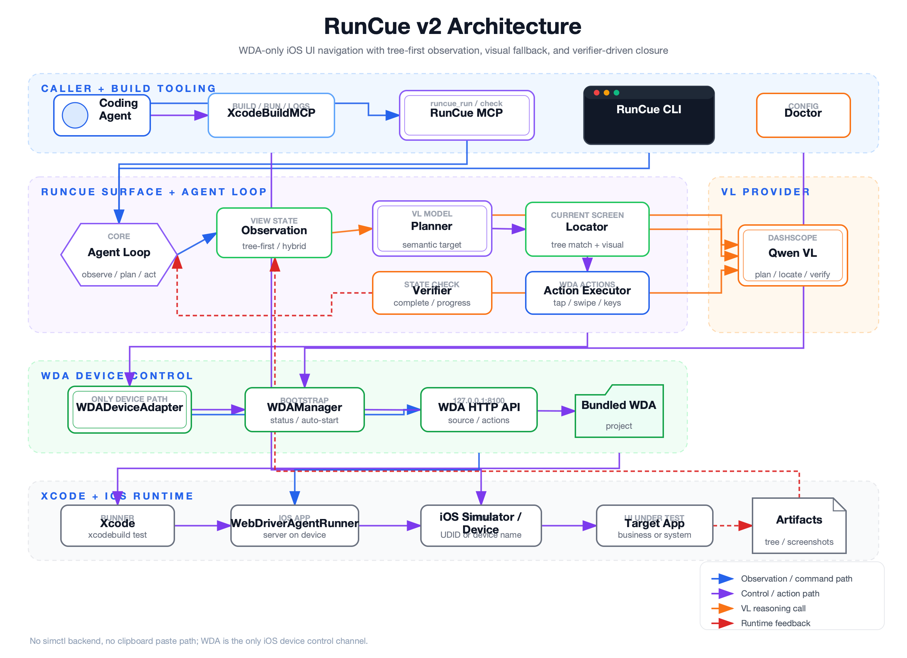
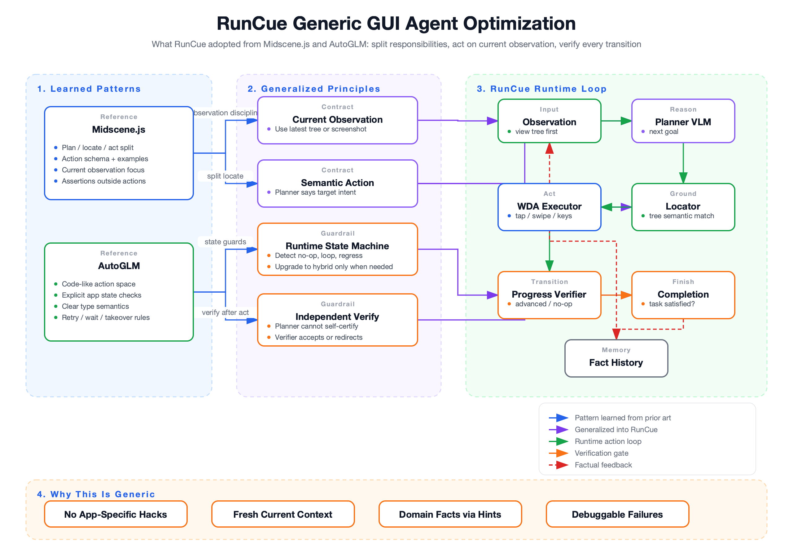

# RunCue Tech Solution v2: WDA-only

更新时间：2026-06-06

## 结论

RunCue v2 的设备控制层已经收敛为 **WDA-only**：

- 不再保留 `simctl` / `legacy-simctl` adapter。
- CLI/MCP 不再暴露 `backend` 参数。
- RunCue 仍然只负责“导航到目标 UI / 检查当前 UI”，不替代 XcodeBuildMCP 的构建、安装、启动、日志能力。
- 输入不再走剪贴板、长按、粘贴按钮等 trick，统一走 WDA `/keys`。
- 视图策略保持 tree-first：普通场景只发 view tree；WebView、SwiftUI 自绘、第三方浮层、tree 不可信或 tree 不变化时才发当前截图，不一次性发送多张截图。
- agent loop 不靠任务专用 prompt 补丁判断成功；planner 负责下一步，locator 负责落点，verifier 负责独立确认当前状态是否满足原始任务。

当前默认稳定模型配置为 `dashscope-vl-plus` / `qwen3-vl-plus`，planner 和 visual locator 统一使用 VL 模型。低成本备选保留 `dashscope-vl-flash` / `qwen3-vl-flash`。

## 工具边界

RunCue 与 XcodeBuildMCP 的分工不变：

| 工具 | 职责 |
| --- | --- |
| XcodeBuildMCP | build、test、install、launch、日志、截图、模拟器生命周期 |
| RunCue | 基于当前已运行 app/系统 app 做 UI 导航、表单输入、结果检查 |
| WDA | RunCue 的唯一 iOS 设备控制通道：source、screenshot、tap、swipe、keys、home |

Coding agent 的推荐流程：

1. 用 XcodeBuildMCP 构建并启动目标 app 或确保系统 app 已打开。
2. 用 `runcue_devices` 或 `runcue devices` 找到同一个 simulator/device 的 UDID 或名称。
3. 调用 `runcue_run` / `runcue run` 导航。
4. 失败时调用 `runcue_doctor` / `runcue doctor`，不要切回旧 backend。

## 当前架构



可编辑源文件：

- JSON: `docs/assets/runcue-architecture-v2.json`
- SVG: `docs/assets/runcue-architecture-v2.svg`
- PNG: `docs/assets/runcue-architecture-v2.png`

```text
Coding Agent
  -> XcodeBuildMCP: build / install / launch / logs
  -> RunCue MCP/CLI: runcue_run / runcue_check / runcue_devices / runcue_doctor
      -> WDADeviceAdapter
          -> WDAManager
              -> existing WDA endpoint, or xcodebuild WebDriverAgentRunner
          -> WebDriverAgent HTTP API
      -> VLM Adapter
          -> view tree first
          -> screenshot only when needed
          -> completion verifier before accepting finish
```

关键代码：

| 模块 | 作用 |
| --- | --- |
| `src/device/wda.ts` | 唯一设备 adapter，负责 WDA session、source、screenshot、actions、keys |
| `src/device/wda-manager.ts` | WDA endpoint 健康检查、自动启动、doctor |
| `src/device/xcode-devices.ts` | 通过 `xcrun xctrace list devices` 枚举 Xcode 可见设备，不使用 `simctl` |
| `src/device/factory.ts` | 只创建 `WDADeviceAdapter` |
| `src/core/agent-loop.ts` | tree-first / screenshot fallback / hybrid 视图策略和 action 执行 |
| `src/mcp/schemas.ts` | WDA-only MCP schema，无 `backend` 参数 |

## 外部方案调研

### Midscene.js

调研来源：

- GitHub: https://github.com/web-infra-dev/midscene
- Prompt / planning 源码: https://github.com/web-infra-dev/midscene/tree/main/packages/core/src/ai-model
- Docs: https://v0.midscenejs.com/

关键设计：

- 复杂 UI 任务不是直接让模型输出坐标，而是拆成 planning、locating、acting。
- action space 由框架注册，每个 action 有 schema、example 和可用性说明，prompt 动态注入。
- 输出协议以 XML 为主，包含 thought、memory、log、action-type、action-param-json、complete。
- 视觉定位优先，action localization 主要基于当前截图；DOM/tree 更多用于数据抽取和辅助理解。
- 每一步只围绕当前 observation 决策，同时维护压缩后的 memory / logs，避免历史截图无限累积。
- 有 report、playground、cache，方便区分是规划错、定位错、模型错还是执行错。
- `aiAssert` / check 类能力与 action 执行分离，适合把“是否满足目标”从“下一步怎么做”里拆出来。

对 RunCue 的启发：

- 当前 `tap(id)` 直接由模型选择，容易被历史 id 或旧树污染。更稳的长期方向是“模型输出目标语义，RunCue 在当前 tree/screenshot 中定位元素”。
- 历史上下文必须是事实日志，不应保留旧模型 thought 或旧 element id。
- 需要把 planning 和 locating 拆开，至少在复杂模式下让模型先选择“目标控件/意图”，再由定位器解析当前 id/坐标。
- locating 应该分两层：先用当前 view tree 做 semantic locator；tree 无法覆盖时，再用当前截图做 visual grounding。
- completion 也应该拆成独立 verifier，而不是让 planner 自己决定“我已经完成”。否则 planner 容易把列表、详情、预览、路线规划等中间态误判为目标态。
- 调试产物要一等化，失败时保存 tree、screenshot、raw model output 和 action history。

### AutoGLM / Open-AutoGLM

调研来源：

- GitHub: https://github.com/zai-org/Open-AutoGLM
- Prompt: https://github.com/zai-org/Open-AutoGLM/tree/main/phone_agent/config

关键设计：

- 手机 GUI agent 使用截图 + 当前 app 信息作为每步 observation。
- 输出是代码式动作：`Launch`、`Tap`、`Type`、`Swipe`、`Back`、`Wait`、`Finish`、`Take_over`。
- 每步先判断当前 app 是否正确，不正确时先 `Launch` 目标 app。
- `Type` 语义包含清空旧文本并输入新文本，减少“旧搜索词污染”。
- 对等待、点击无效、搜索结果不对、页面加载失败都有明确状态机规则，例如 wait 最多连续三次、点击无效要换位置或换路径。
- 登录、验证码、支付等敏感场景允许 `Take_over`，不强行自动化。

对 RunCue 的启发：

- 复杂 App 成功率来自“模型能力 + 状态机约束 + 清晰动作语义 + 执行后验证”，不是任务专用 prompt 文案本身。
- 对系统 app 或独立 CLI 任务，需要显式 fresh start；否则旧路线、旧搜索、旧输入框值会成为第一屏上下文，模型自然会沿着旧状态走偏。
- `type(text)` 应当继续保持 WDA 直接输入，并把“当前输入框值”作为事实反馈给模型。
- `wait`、无变化、app crash / app not running 等情况应该由 runtime 识别并恢复或失败，不应继续交给模型猜。

## 通用化 Agent 优化方案



可编辑源文件：

- JSON: `docs/assets/runcue-agent-optimization-v2.json`
- SVG: `docs/assets/runcue-agent-optimization-v2.svg`
- PNG: `docs/assets/runcue-agent-optimization-v2.png`

这轮迭代最关键的判断是：复杂 App 自动化不能靠给某个 App 写更多 prompt 补丁来解决。那样即使某个地图用例跑通，也会把 RunCue 变成“业务规则集合”，下一个 App 仍然会失败。Midscene.js 和 AutoGLM 的共同点是，它们把 GUI agent 拆成一组稳定的通用职责，而不是让一个模型在同一步里同时完成理解、定位、执行和自我验收。

从 Midscene.js 学到的核心是职责分层：

- **Planning**：模型只决定下一步语义目标，例如“点击搜索框”“选择最近的结果”“进入路线步骤”。
- **Locating**：运行时基于当前 observation 定位真实控件或坐标，不复用历史 id。
- **Acting**：动作空间有明确 schema，动作参数可校验，执行结果可记录。
- **Asserting / Checking**：检查当前状态是否满足目标，和下一步动作决策分离。
- **Memory / Logs**：历史不是旧截图和旧 thought 的堆叠，而是压缩后的事实记录。

从 AutoGLM 学到的核心是状态机约束：

- 每一步都先基于当前屏幕做判断，而不是依赖历史页面假设。
- 动作语义要清楚，例如 `Type` 不只是“打字”，还隐含清理旧输入、确认输入结果这类执行语义。
- 对 `wait`、点击无效、页面没变化、进入错误页面、循环点击等情况要有运行时规则，不能让模型无限猜。
- 当登录、支付、验证码等场景不适合继续自动化时，要允许接管或明确失败。

RunCue 当前落地成下面这套通用闭环：

1. **Observation contract**：每一步只基于当前 view tree；tree 不可信、tree 不变、WebView/SwiftUI/自绘 UI 等场景才升级为 hybrid screenshot。历史里不放旧截图，也不让模型复用旧 element id。
2. **Semantic action contract**：planner 优先输出 `tap(target=...)`、`swipe(target=..., direction=...)`、`type(...)` 这类语义动作，而不是直接输出旧 id 或坐标。
3. **Locator split**：tree locator 先用当前 tree 做语义匹配；tree 找不到或复杂 UI 时，visual locator 用当前截图做 grounding。locator 只解决“点哪里”，不参与业务判断。
4. **WDA executor**：所有真实操作统一走 WDA，输入走 `/keys`，不再有剪贴板、长按、粘贴菜单等 trick。执行后返回事实结果，例如输入框当前值、UI diff、是否无变化。
5. **Progress verifier**：每步动作后判断状态是 `advanced`、`unchanged`、`regressed`、`looped` 还是 `unknown`。只有异常进度才注入下一轮 history，并附带 `avoidRepeat`，避免 verifier 抢 planner 的决策权。
6. **Completion verifier**：planner 说完成时，RunCue 不直接相信；独立 verifier 用原始任务、当前 observation、事实历史判断是否真的完成。拒绝完成时返回 `nextGoal`，让 planner 继续推进。
7. **Hints as product facts**：复杂 App 的特殊知识通过 `task` / `hints` 传入，例如“某个产品的非标准入口是什么”。这类信息是调用方提供的产品事实，不是 RunCue 核心 prompt 里硬编码的 App 规则。

因此，“Apple 地图需要点路线步骤”这类问题不应该做成 RunCue 代码里的地图规则。正确用法是：coding agent 在任务或 hints 里提供这个产品事实；RunCue 负责用通用闭环把这个事实落到当前屏幕上，先找语义目标，再定位当前元素，再执行，再验证是否推进。这样同一套机制也能处理 WebView、自绘控件、第三方浮层、非标准按钮文案和复杂多步流程。

## Planning / Locating / Verifying 分层

RunCue v2 不再把“模型选择旧 id”作为主路径。当前实现采用：

```text
Planner VLM
  -> output: tap(target="Search field") / long_press(target="...") / swipe(target="...", direction="left")
      -> Tree Locator
          -> current view tree semantic match
          -> current node frame / center point
      -> Visual Locator fallback
          -> current screenshot + target + optional tree context
          -> VLM grounding returns {x,y,confidence,reason}
      -> WDA action execution
      -> factual result feedback

When planner outputs complete:
  -> Completion Verifier
      -> original task + current observation + factual history
      -> {complete, confidence, reason, nextGoal}
      -> accept finish only when verifier confirms
```

当前能力：

- planner prompt 要求 viewtree/hybrid 模式优先输出 semantic target，不输出历史 id。
- `tap`、`long_press`、`swipe` 支持 `target` 参数。
- tree locator 使用当前节点的 label/value/type/children text 打分，优先 Button、TextField、SearchField、Cell 等可交互节点。
- tree locator 失败时，runtime 按需抓当前截图，调用 `VLMAdapter.locateTarget()` 做 visual grounding。
- visual locator 只返回坐标和置信度，不参与业务决策；置信度低于阈值则动作失败并反馈给下一轮。
- planner 输出 `<complete>` 时，runtime 会调用 `VLMAdapter.verifyTask()` 做独立完成判定。
- verifier 不写 app-specific 规则，只判断“当前观测是否满足原始任务”；如果否，返回 `nextGoal` 作为下一轮事实反馈。

取舍：

- tree locator v1 是轻量语义匹配，不做 app-specific 规则。
- visual locator v2 增加一次 VLM 调用，只在 tree 无法定位 semantic target 时发生。
- completion verifier 只在模型准备结束任务时调用，不会让每一步都发送截图；viewtree 模式下优先只发当前 tree。
- 当前 visual locator 输出坐标，不返回 element id；后续如需更强稳定性，可以加入 bbox、多候选和交叉验证。

### Progress verifier 与 hybrid 升级

仅靠 completion verifier 只能避免误报成功，不能解决“下一步怎么找”的问题。当前进一步加入了 action outcome verifier：

```text
Previous action + current observation
  -> Progress Verifier
      -> {complete, confidence, progress, reason, nextGoal, avoidRepeat}
      -> progress = advanced | unchanged | regressed | looped | unknown
```

策略：

- 每步 action 后，下一帧先评估该动作是否让 UI 更接近原始任务。
- `advanced` / `unknown` 只写日志，不注入 planner history，避免 verifier 的建议抢走 planner 的决策权。
- `unchanged` / `regressed` / `looped` 才写入事实 history，并附带 `avoidRepeat`。
- 当 progress verifier 判断 `unchanged` / `regressed` / `looped`，且当前仍是 viewtree 模式时，本步升级为 hybrid，发送当前截图给 planner。
- hybrid/screenshot 下也优先让 planner 输出 semantic target，再由 visual locator ground 坐标；`tap_xy` 只作为最后兜底。

这个策略用于打断通用循环，例如：

```text
route label -> no UI change -> avoid repeating route label -> hybrid screenshot
route summary cell -> route steps detail -> not complete -> avoid reopening same detail
wrong coordinate -> route card collapsed -> regressed -> hybrid screenshot
```

它不是 Maps 专用规则，也不依赖“开始导航”等硬编码业务文案；Maps 只是当前验证样例。

### 本次 Maps 失败的结论

命令：

```bash
node dist/cli.js run "Open Maps, search for the nearest Walmart, and start navigation" --device "iPhone 17 Pro Simulator" --bundle-id com.apple.Maps --fresh-app --max-steps 10 --timeout 90
```

现象：

- 搜索、输入、点击第一个结果的“路线”成功。
- 路线加载完成后，planner 点击了路线摘要/路线项，进入过路线详情或停留在路线规划态。
- planner 曾把 `RouteStepsView` / `RouteStepList` 这类详情态误判为“导航已启动”并输出完成。

根因不是“缺少某个地图文案规则”，而是 loop 中只有 planner，没有独立 verifier。planner 在同一次回答里既决定下一步动作，又自我判断任务完成，容易把中间状态当成目标状态。

处理方式：

- 删除导航专用 prompt 补丁，不在 prompt 中写“路线/开始导航”等业务规则。
- 引入通用 completion verifier：只有 verifier 确认当前 UI 满足原始任务，RunCue 才接受 `<complete>`。
- verifier 拒绝完成时，把 `reason` 和 `nextGoal` 作为事实结果写入 history，下一轮 planner 基于这个反馈继续找可执行路径。
- 引入 progress verifier 后，路线 label 点击无变化会触发 hybrid，路线详情/折叠/错误坐标会被标记为 loop/regressed，避免继续重复同一类动作。
- 搜索类任务增加通用输入规则：用户明确要求搜索某个文本时，聚焦空搜索框后应先输入该文本，不直接选择历史/最近建议。

## 旧架构问题

### 1. 输入困难

旧链路的输入依赖多段条件分支：

- ASCII 走 HID type。
- 中文、特殊字符、符号走设备剪贴板。
- 再通过长按输入框、识别系统粘贴菜单完成粘贴。

问题：

- 多模拟器、多窗口时剪贴板同步和菜单焦点不稳定。
- 粘贴菜单文案、语言、系统版本差异会影响成功率。
- agent loop 里必须写很多“已粘贴，不要再输入”的补偿提示。

v2 处理：

- `type(text)` 统一映射到 WDA `/session/:id/keys`。
- agent loop 的反馈统一为“Text entered through WDA”。
- 不再保留 clipboard / long-press / paste fallback。

局限：

- 当前实现是“先 tap 输入框，再 `/keys`”，不是 element-level `setValue`。
- 如果后续要做 element-level 输入，需要 WDA source 暴露稳定 element id，或者通过 WDA element query 重新定位元素。

### 2. 视图树不够丰富

旧链路依赖 accessibility tree 时，WebView、SwiftUI 自绘、canvas、第三方 SDK 浮层可能缺内容，导致模型只看到系统 chrome 或很稀疏的节点。

v2 处理：

- 默认只发送 view tree，降低成本和延迟。
- tree 获取失败时发送截图。
- tree 稀疏时进入 hybrid：发送当前 view tree + 当前截图。
- tap、swipe、wait 等动作后 tree 完全不变时，下一步强制 screenshot，用来捕捉未进 accessibility tree 的浮层或视觉状态变化。
- 历史上下文只传事实摘要和系统 result，不传多张历史截图，不传旧模型 thought，不传旧 element id。
- element id 只在当前 view tree 内有效，prompt 明确禁止从历史复用 id。

优点：

- 简单原生页面成本低、速度快。
- 复杂页面能用视觉模型补齐 tree 盲区。
- 不再把 token 成本作为主要约束，可以在确实需要时使用更准的 VL/多模态模型。

风险：

- 截图坐标动作仍依赖模型视觉定位质量。
- hybrid 模式需要模型同时理解 tree id 和截图坐标，prompt 需要继续通过真实任务校准。

### 3. 工具定位

RunCue 不做 build、install、launch，也不接管模拟器管理。这样可以避免与 XcodeBuildMCP 抢设备状态。

保留的 RunCue 能力：

- `runcue_run`: 完成自然语言 UI 导航任务。
- `runcue_check`: 读取当前 UI 并回答问题。
- `runcue_devices`: 列出 Xcode 可见设备和 WDA endpoint 状态。
- `runcue_doctor`: 检查 Xcode、设备、WDA project/endpoint、签名配置。

MCP metadata 必须把 coding agent 需要感知的参数契约写清楚：

- `deviceId` 必传，必须使用 XcodeBuildMCP / `runcue_devices` 返回的设备名或 UDID，不能传 `booted`。
- `platform` 可选，默认走 RunCue 配置；设备有歧义时显式传 `ios-simulator` 或 `ios-device`。
- `bundleId` 在普通续接场景可选，但在 `freshApp=true` 时必传；系统 app、多 app WDA session 建议始终传。
- `freshApp=true` 表示通过 WDA terminate + launch 重启 `bundleId`，适合独立任务和系统 app 旧状态隔离；如果 XcodeBuildMCP 已经准备好业务深链状态，则不要使用。
- MCP runtime 会在 `freshApp=true` 且缺少 `bundleId` 时直接返回 `validation_error`，避免 coding agent 拿到 WDA 内部异常后误判为设备故障。
- 复杂交互、非常规文案、隐藏入口、自绘制 UI、WebView/SwiftUI 或重试失败场景，coding agent 应该把已知的操作事实写进 `task` 或 `hints`。例如 Apple 地图没有常规“开始导航”按钮时，任务可以补充：“Apple 地图启动导航时，如果没有常规的开始导航按钮，需要在路线卡片页面点击路线卡片列表中的‘路线步骤’。”
- 这些提示应该是可复用的产品事实或流程事实，避免写成坐标补丁。RunCue 保持通用 agent 能力，不在核心 prompt/代码里硬编码具体 App 规则。

删除的能力：

- `legacy-simctl` backend。
- `--backend` CLI 参数和 MCP `backend` 字段。
- `simctl pbcopy`、长按粘贴菜单输入。
- `xcodebuildmcp ui-automation` 作为 RunCue 操作执行通道。

## WDA 可用性

### npm install 能解决什么

`npm install -g runcue` 应该安装：

- `runcue` CLI。
- RunCue MCP server。
- TypeScript/Node runtime 依赖。

但仅安装 RunCue 不等于 Apple 侧环境全部就绪。WDA 还涉及：

- 本机必须安装完整 Xcode。
- 模拟器或真机必须对 Xcode 可见。
- 真机需要信任 Mac、解锁、开启 Developer Mode。
- 真机需要有效 Apple team id 和 WDA bundle id 签名配置。

当前实现支持三种 WDA 来源：

| 来源 | 当前状态 | 说明 |
| --- | --- | --- |
| `wda.endpoint` | 可用 | 用户或外部流程已启动 WDA，RunCue 直接连接 |
| `wda.projectPath` | 可用 | RunCue 用 `xcodebuild test` 启动 WebDriverAgentRunner |
| vendored `appium-webdriveragent` | 已完成 | RunCue 包内包含 `vendor/appium-webdriveragent/WebDriverAgent.xcodeproj`，默认自动发现 |

因此模拟器场景可以做到接近开箱即用：`npm install` 后 RunCue 包内带 WDA project，首次运行自动通过 `xcodebuild test` 安装并启动 WDA。真机场景仍必须暴露签名前置条件。

### Coding agent 需要做什么

模拟器：

1. 用 XcodeBuildMCP `build_run_sim` 启动目标 app。
2. 把同一个 simulator 的 UDID 或名称传给 RunCue。不要传 `booted`，WDA path 下它是歧义值。
3. 如果没有运行中的 WDA，RunCue 会尝试通过 `wda.projectPath` 自动启动。
4. 失败时调用 `runcue doctor --device <UDID-or-name> --platform ios-simulator`。

真机：

1. 用 Xcode/XcodeBuildMCP 确认设备可见、已信任、已解锁、Developer Mode 已开启。
2. 配置 `RUNCUE_WDA_TEAM_ID` 和 `wda.signing.bundleIdPrefix`。
3. 提供真机 UDID 和 `--platform ios-device`。
4. 首次运行要允许 WDA runner 安装和签名。

### fresh app 策略

RunCue 不能默认清空 app 状态，因为常见工作流是 XcodeBuildMCP 已经把业务 app 启动到某个页面，RunCue 接着完成后续 UI 导航。

但系统 app、独立 CLI 验证、回归测试任务需要干净入口。否则像 Apple Maps 这类 app 会保留旧路线、旧搜索词、旧目的地和旧 bottom sheet，模型第一步就会被旧状态带偏。

当前策略：

- `runcue run --fresh-app --bundle-id <id>` 会先通过 WDA terminate + launch 目标 app，再开始 agent loop。
- MCP `runcue_run` 对应参数为 `freshApp`。
- 默认 `freshApp=false`，保留当前页面，适合 XcodeBuildMCP 已经准备好业务上下文的场景。
- fresh app 只负责重启 app，不清空 App 数据；如果需要删除应用数据，应交给 XcodeBuildMCP / 外部测试环境管理。
- 因为 app 数据不会被清空，系统 app 仍可能显示历史数据。RunCue 不在 prompt 里写 app-specific 补丁，而是通过 planning / locating 分层降低旧状态和旧 id 对动作执行的影响。

## 模型选择

RunCue 的首要目标是 UI 导航稳定性。为降低架构复杂度并保证 visual grounding 能力，默认统一走 VL 模型：

| 模型 | 定位 | 建议 |
| --- | --- | --- |
| `qwen3-vl-plus` | 专用 VL plus，兼顾 planner 文本理解和 visual locator 截图 grounding | 默认 stable |
| `qwen3.7-plus` | 通用强推理模型 | 暂不作为默认；后续只有在拆分 planner/locator 时再考虑 |
| `qwen3.6-plus` | 多模态 plus，精度优先但低于最新旗舰 | 可作为 balanced/stable fallback |
| `qwen3.5-flash` | 低价、低延迟 | 只适合简单 tree-first 导航或大规模回归 |
| `qwen3-vl-flash` | 专用 VL flash，成本最低 | fast 模式或简单页面 |

价格判断以官方计费页为准。当前公开信息显示：

- DashScope `qwen3.7-plus`：0-256K 输入约 ¥2 / 1M tokens，输出约 ¥8 / 1M tokens；256K-1M 输入约 ¥6，输出约 ¥24。
- DashScope `qwen3.6-plus`：0-256K 输入约 ¥2 / 1M tokens，输出约 ¥12 / 1M tokens；256K-1M 输入约 ¥8，输出约 ¥48。
- DashScope `qwen3.5-flash`：0-128K 输入约 ¥0.2 / 1M tokens，输出约 ¥2 / 1M tokens；128K-256K 输入约 ¥0.8，输出约 ¥8；256K-1M 输入约 ¥1.2，输出约 ¥12。
- DashScope `qwen3-vl-plus`：0-32K 输入约 ¥1 / 1M tokens，输出约 ¥10 / 1M tokens。
- DashScope `qwen3-vl-flash`：国际区 0-32K 输入约 ¥0.367 / 1M tokens，输出约 ¥2.936 / 1M tokens；中国内地价格以控制台为准。

用户提到的 `qwen3.6-plus` 和 `qwen3.5-flash` 需要以实际账号所在控制台的可用模型和计费页再确认。RunCue 配置里保留这些 provider 名称，但真正上线前需要在目标账号跑 smoke test。

推荐策略：

- 默认：`dashscope-vl-plus` / `qwen3-vl-plus`，planner 和 locator 复用同一个 VL provider。
- 批量、简单、非关键路径：`dashscope-vl-flash`。
- 暂不引入 plannerProvider / locatorProvider 双模型配置；等成本或延迟成为实际瓶颈后再拆。

## 开发计划与进展

| 阶段 | 状态 | 内容 |
| --- | --- | --- |
| P0: WDA-only 收敛 | 已完成 | 删除 `ios-simctl.ts`；删除 backend 参数；factory 只创建 WDA；输入反馈改为 WDA；设备列表改为 `xctrace` |
| P1: 构建与单测 | 已完成 | `npm run build` 已通过；`npm test` 已通过 |
| P2: 真实 WDA 运行验证 | 已完成 | 已在 iOS simulator 上自动启动 vendored WDA，创建 Maps session 并完成截图 |
| P3: 发布开箱即用 | 已完成 | vendored `appium-webdriveragent@13.2.0`；`npm pack --dry-run` 验证包含 WDA project 且不包含旧 simctl dist |
| P4: agent 闭环反馈 | 已完成 | 历史改为事实记录；移除 assistant thought-only JSON；记录执行结果、输入值、UI label diff；tree 不变时强制视觉兜底 |
| P5: fresh app / 旧状态隔离 | 已完成 | `--fresh-app` / MCP `freshApp`；WDA terminate + launch；避免系统 app 旧页面污染任务 |
| P6: element-level 输入 | 待定 | 如果 WDA source 能稳定关联 element id，再新增 `set_text(id,text)`；否则维持 tap + keys |
| P7: 真机验证 | 待定 | 需要真实 Apple team、签名 profile、真机授权环境 |
| P8: planning / locating 分层 | 已完成 | 参考 Midscene，把模型直接输出 `tap(id)` 改为优先输出 `tap(target)`；运行时只基于当前 observation 定位；tree locator + visual locator fallback 已接入 |
| P9: completion verifier | 已完成 | 删除导航专用 prompt 补丁；新增 `VLMAdapter.verifyTask()`；planner 输出 finish 时先由 verifier 独立确认，失败则反馈 `nextGoal` 继续闭环 |
| P10: progress verifier / hybrid 升级 | 已完成 | 每步 action 后评估 advanced/unchanged/regressed/looped；只把异常进度注入 history；异常进度自动升级 hybrid；hybrid/screenshot 优先 semantic target + visual locator |
| P11: MCP metadata 参数契约 | 已完成 | `runcue_run` / `runcue_check` / `runcue_devices` / `runcue_doctor` 描述更新为 WDA-only；明确 `deviceId`、`platform`、`bundleId`、`freshApp` 规则；复杂/非标准 UI 要通过 `task` 或 `hints` 传入操作事实；`freshApp` 缺少 `bundleId` 时返回 `validation_error` |

## 当前取舍

优点：

- 设备控制链路单一，调试面更小。
- 输入稳定性明显高于剪贴板/粘贴菜单方案。
- 真机路径不再是远期抽象，WDA 本身支持模拟器和真机。
- CLI/MCP 对 agent 更简单，不再让 agent 判断 backend。

缺点：

- WDA 引入 Xcode signing / build runner 成本。
- 初次启动 WDA 比旧模拟器 CLI 慢。
- 如果 npm 包不内置 WDA project，用户仍需配置 `wda.projectPath` 或 `wda.endpoint`。
- 对非 accessibility UI 仍要依赖视觉模型，不能完全靠 view tree。

最终判断：

以工具可用性和稳定性为第一优先级时，WDA-only 是正确方向。旧 `simctl` 路径能降低安装门槛，但输入和可观测性不稳定，继续保留会让代码和调试都被旧 trick 拖住。v2 应该把“安装/签名前置”显式暴露给 `doctor` 和文档，而不是用 legacy fallback 掩盖底层不稳定。
